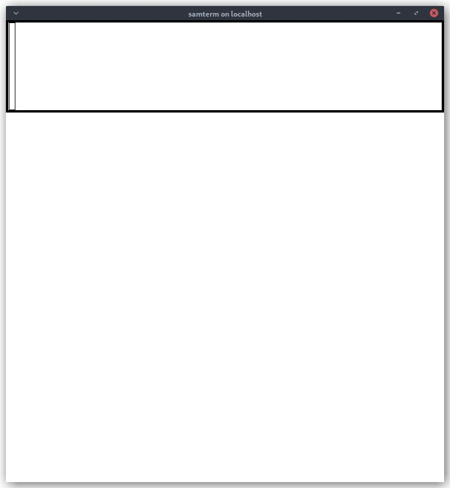
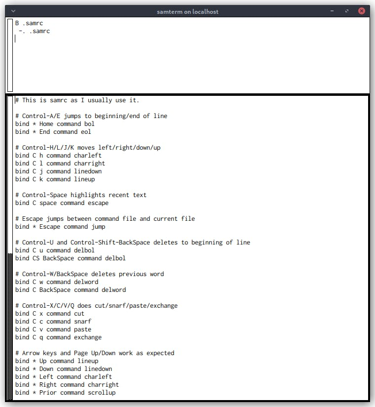
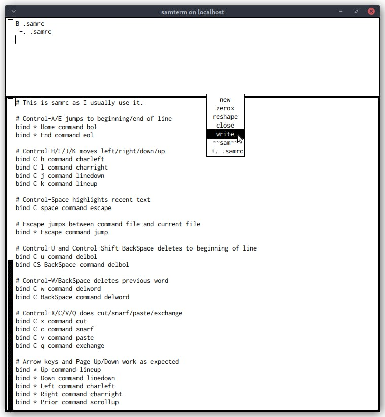
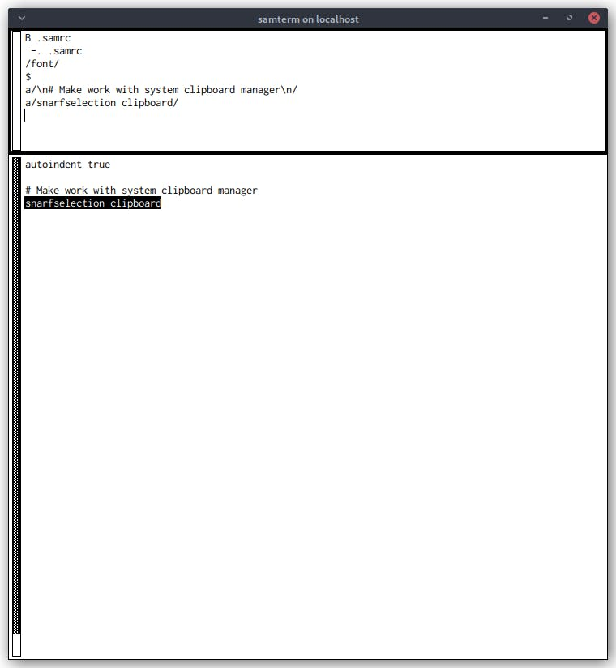
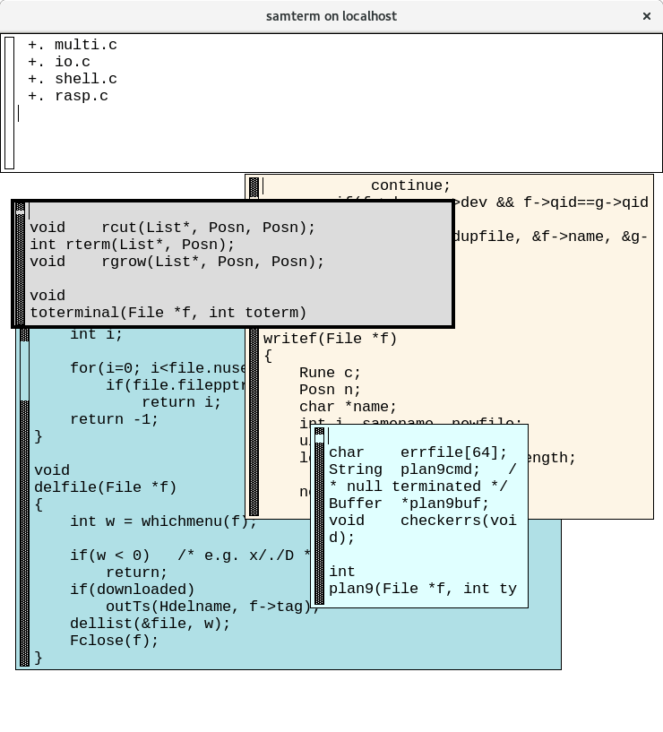

# Introduction to the Sam Text Editor


プログラマーは道具に情熱を注ぐものであり、特に情熱を注ぐ道具があるとすれば、それはテキストエディターである。Emacsとviのエディタ戦争は何十年も続いており、VS CodeやSublime Textといった新しい挑戦者がその優位性を競い合っています。私は、これらのエディタほど有名ではないが、それに劣らず優れた血統を持つエディタを試してみることにした。

Samは、Plan 9オペレーティングシステムに含まれる2つのテキストエディタのうちの1つである。もともとは1980年代初頭にRob PikeがBlitウィンドウズ端末のために設計したものです。

現代のLinuxとBSD用のSamは、2つの異なるソースから入手することができます。ひとつは Plan 9 プログラムを他の Unix 系 OS に移植している Plan 9 from User Space で、もうひとつは 1990 年代の Unix 用 Sam の移植版の開発を続けている Deadpixi Sam です。私はDeadpixi Samをインストールし、レビューしました。もし、別のバージョンの Sam をインストールした場合、設定の詳細は異なるかもしれませんが、ここに書かれている情報のほとんどは、すべてのバージョンの Sam に適用されるはずです。

## 簡単なチュートリアル

Viは、終了方法さえ知らない初心者プログラマーを引っかけることで有名です。私はここで有罪を認めます。初めてHP-UXサーバでviセッションに落とされたとき、何もすることができず、何かを壊したのではないかと思って怖くて人に聞くことができませんでした。Samの学習曲線はそれほど急ではありませんが、Samを初めて起動したときにこのような画面が表示されたときに何をすればいいのかが明らかではありません。



もちろん、manページを読めばいいのですが、manページはリファレンスソースであるため、Samを紹介するようなレイアウトにはなっていません。編集するためのテキストファイルを読み込む方法すら明確でないため、まだ使うこともできない編集コマンドの数々を詳しく説明するところから始まります。その前にmanページの半分以上を読み通さなければならない。Samは1980年代から存在しているにもかかわらず、数分で立ち上げてSamを実験できるような簡単なチュートリアルを見つけることができなかったので、ここでそれをやってみようと思います。

最初にSamを起動すると、上下のエリア、つまり "ウィンドウ" に分かれています。一番上のウィンドウは、コマンドウィンドウです。ここで、テキストを操作したり、Samをコントロールするためのコマンドを入力します。下はテキストウィンドウです。最初は1つのテキストウィンドウからスタートしますが、テキストウィンドウはいくつでも開くことができます。テキストウィンドウには、編集中のファイルの内容が表示されます。

Deadpixi Samは、ホームディレクトリにある`.samrc`ファイルで設定することができます。Deadpixi Samに同梱されている`doc/samrc`のサンプルを`~/.samrc`にコピーすると、便利なデフォルトが用意されているのでおすすめです。このファイルをSamで編集するには、コマンドウィンドウで`B .samrc`と入力し、Enterを押してファイルを読み込みます。カーソルが変化します。テキストウィンドウをポイントしてください。その中のどこかを右クリックして、ファイルを表示します。



テキストウィンドウ内で左クリックすると、テキストカーソルを移動させることができます。左クリックしたままドラッグしてテキストを選択したり、ダブルクリックで単語を選択することができます。大括弧、括弧、引用符などの内側をダブルクリックすると、括弧内のすべてのテキストが選択されます。デフォルトでは、キーボードのCtrl+e,x,d,sでテキストカーソルを上下左右に移動させることができます。Deadpixi Samに付属するsamrcをコピーすることを強くお勧めする理由は、矢印キーと（少なくともVimから来た人には）より馴染みのあるCtrl+k,j,l,hでテキストカーソルを移動できるようになるからです。テキストウィンドウで直接ファイルを編集することができます。



右クリックしたまま（最近のOSでは、右クリックして放すとコンテキストメニューにアクセスするのが一般的ですが、Samでは右クリックしたままでないとメニューにアクセスできません）、ウィンドウを操作するためのコマンドを含むメニューにアクセスできます。コマンドの中には、ウィンドウのサイズや位置を選択するための十字カーソルが用意されているものもあります。ウィンドウ操作の下には、コマンドウィンドウである `~~sam~~` で始まる利用可能なファイルのリストが表示されます。リストからファイルを選択すると、そのファイルで最も最近使用されたウィンドウがカレントとなります。もし、そのファイルでウィンドウが開かれていなければ、ウィンドウを開くように促されます。

ミドルクリックを押しながら（上記と同じですが、マウスのホイールを押しながら）、編集コマンドのメニューを表示します。このメニューでコピー（Samではなぜかスナフと呼ばれる）、カット、ペーストなどの操作ができます。Deadpixi Samに付属する`samrc`をコピーすると、おなじみのCtrl+x,c,v,qとカット、スナッフ、ペースト、エクスチェンジがバインドされます。

Samはシステムのクリップボードを使いませんが、編集メニューから\<exch\>でSamのスナフキンをシステムと入れ替えることができます。これにより、他のアプリにコピー＆ペーストしたり、逆に他のアプリにコピー＆ペーストすることができます。デフォルトでは、snarfとシステムの選択部分を入れ替えます。Linuxでは、ミドルクリックしたときにペーストされるものです。これは私が使っているクリップボードマネージャーと統合されていなかったので、`.samrc`に一行追加して、Samにシステム選択の代わりにシステムクリップボードを使うように伝えました。

```
$
a/\n# Make work with system clipboard manager\n/
a/snarfselection clipboard/
```

ドル記号は、Samにファイルの末尾にジャンプするように指示します。`a/text/`コマンドは、現在の位置にテキストを追加します（挿入する`i`と置換する`c`もあります）。Samで使用できるコマンドのいくつかを示すためにこのようなことをしましたが、上記の例では、おそらくテキストウィンドウに直接入力した方が簡単だったでしょう。また、コマンドウィンドウに `/font/` のような正規表現を入力すると、テキストウィンドウ内の文字列を検索することができます。使用可能なコマンドの完全なリストについては、Samに付属するmanファイルを参照してください。



これで、変更を保存してSamを終了する準備が整いました。コマンドウィンドウに`w`と入力し、変更内容をファイルに書き込みます。そして、`q`を入力して終了します。未保存の変更があるときに`q`を打つと、Samは閉じる代わりに、変更されたファイルを表示します。未保存の変更のまま強制的に終了させるには、2回目に`q`をタイプしてください。Deadpixi Samに付属する`samrc`をコピーすると、おなじみのCtrl+sで書き込みができます（Ctrl+zでアンドゥもできます）。

## Samのレビュー

Samは、最近のほとんどのOSで使われている慣習とは異なることをたくさんしています。例えば、スクロールバーが右ではなく左についている。左クリックとドラッグでスクロールバーを掴んで上下にスクロールできますが、マウスを上に動かすと下にスクロールし、下に動かすと上にスクロールします。レビューで述べたように、メニューから選択するにはマウスの右ボタンと中ボタンを押し続ける必要があります（クリックして離すだけではだめです）。これらは、OSの慣例に従えば問題ないのですが、多くの新規ユーザーが期待するものとは正反対のものでしょう。これは、Samが40年近く前の製品であり、これらの慣習の多くが確立される前に作られたからである。

Plan 9 from User Spaceのようなプロジェクトや、Hacker NewsやRedditへの投稿を見れば、Plan 9に今でも熱烈な信奉者がいることは明らかです。また、SamはKen Thompson、Bjarne Stroustrup、Brian Kernighanのお気に入りのエディタであると伝えられている。Deadpixiのようなプロジェクトは、マッスルメモリーが蓄積されたユーザーを満足させるためにSamをそのまま保存することと、新しいユーザーを惹きつけるために近代化することの間の微妙なラインを踏む必要がある。Deadpixiに付属する`samrc`をコピーすることで、Samのキーバインディングを設定し、最近のOSにおける他のテキスト入力とほぼ同じ動作をさせることができます。Shiftキーを押しながら矢印キーでテキストを選択できるようにするのがまだ足りないのですが、`.samrc`だけでこれを実現するのは無理そうです。数日間Samで遊んでいる間に、自分の`.samrc`にいくつか追加で手を加えました。

```
bind * Home command bol
bind * End command eol
```

これにより、HomeキーとEndキーは期待通りの動作をするようになりました。Deadpixiのメンテナは、サンプルの`samrc`のフォントを12 pt. Go Regularにしていますが、私はこれを13 pt. Inconsolataに変更しました。Deadpixiのサンプル`samrc`では、新しいウィンドウの背景色のリストも追加されていますが、私は白だけにしました。タブは空白2文字に、前述のsnarfselectionはクリップボードに設定しました。

Samはデスクトップ環境とウィンドウマネージャが一般的になる前に作られました。オリジナルのSamはターミナル（パソコンにあるようなターミナルエミュレータではなく、実際のターミナル）上で動作するように設計されています。タブのような現代的なメタファーを使う代わりに、Samは独自の初歩的なウィンドウ管理機能を備えています。複数のテキストウィンドウを開いて、Samをこのように表示することができます（Deadpixi REAMDEのスクリーンショット）。



ウィンドウの作成と配置は、マウスを使ってウィンドウの領域を掃引する方法しかありません。これは不便で、私が Sam を使って実験していた数日間は、起動時に作成される単一のテキストウィンドウにどのファイルを配置するかを切り替えるのに、主に右クリックメニューを使用していました。ウィンドウのタイリングやAcmeのようなタイリングのためのキーバインディングは、DeadpixiのREADMEに開発目標として挙げられていますが、まだ実装されてはいません。

SamのGUIは、Motifのようなウィジェットツールキットが使用するX Window Systemのウィジェットを作成するためのプリミティブを提供するライブラリであるXtで構築されています（一方、GTKとQtは独自のウィジェットを描画します）。そのため、明らかに時代遅れのルック＆フィールになっています。Rob Pikeが1987年に発表したSamを説明するオリジナルの論文のスクリーンショットが、現在のSamと全く同じに見えるのは、そのためです。Xtへの依存を取り除くことはDeadpixiのREADMEにストレッチゴールとして記載されていますが、開発の継続は遅いようです。この記事を書いている時点では、最後のコミットから1年以上経っています。

また、多くのユーザーがテキストエディタに期待しているであろう他の機能もサポートしていません。シンタックスハイライトはREADMEの "Things That Won't Ever Happen (Sorry)" にリストアップされています。GitHub の issue で、メンテナはシンタックスハイライトを実装しないのではなく、現在の 30 年前のコードベースではほとんど不可能であることを明言しています。もし彼がTclでGUIを書き直してXt依存をなくせば、シンタックスハイライトは可能になるかもしれません。

数日間Samで遊んでみたが、これが私のメインのテキストエディタになるとは思えない。Samはコンピュータの歴史を垣間見るにはいいものでしたし、たまに設定ファイルを編集するために残しておくかもしれませんが、プログラミングをするときにはGeanyを使い続けるでしょう。構造的な正規表現と、現在の選択部分をシェルコマンドにパイプし、その結果で選択部分を置き換えることができるのはすてきですが、シンタックスハイライトのようなものなしに行うほどの説得力はありません（さらに、最近のほとんどのテキストエディタは他のこともできます）。

あなたはSamファンですか？毎日の運転に使っていますか？ぜひお聞かせください。どのくらい使っていますか？他のテキストエディタよりSamが好きな理由は何ですか？私が見逃しているものはありますか？何かヒントやコツがあれば教えてください。


