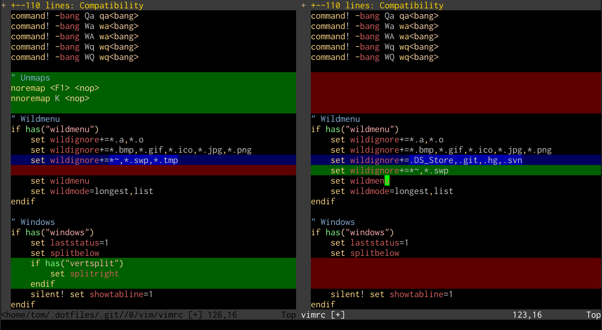

# 

# Unix as IDE: Introduction

このエントリーは、[ Unix as IDE](https://blog.sanctum.geek.nz/series/unix-as-ide/ "Unix as IDE") シリーズ全7回のうちの第1回です。

*このシリーズは
[中国語](https://conanblog.me/Unix-as-IDE--Chinese-/)、
[ロシア語](https://habr.com/post/150930/)、
[トルコ語](https://ahmetkun.com/post/bir-ide-olarak-unix/)
[韓国語](http://dgkim5360.tistory.com/entry/unix-as-ide-korean-translation)、
[電子書籍](https://github.com/mrzool/unix-as-ide)としてフォーマットされています。

初心者も経験豊富なプロのプログラマーも、IDE、つまり[統合開発環境](https://en.wikipedia.org/wiki/Integrated_development_environment)のコンセプトを高く評価している。 コードを整理し、書き、保守し、テストし、デバッグするために必要な主要ツールを、すべての異なるツールに共通のインターフェイスを持つ統合されたアプリケーションの中に持っていることは、確かに非常に貴重な資産です。さらに、さまざまな言語でのプログラミングのために特別に設計された環境は、オートコンプリート、構文チェック、ハイライトなどの利点をもたらす。

このようなツールは、GNU/LinuxやBSDを含むすべての主要なデスクトップオペレーティングシステム上で開発者が利用可能であり、その多くは無料で利用できるため、Windowsのメモ帳や`nano`や`cat`でコードを書く正当な理由はありません。

しかし、Unixとその現代の派生ツールの信奉者の間では、「UnixはIDEである」というマイナーなミームがあり、これは開発者がターミナル上で利用できるツールが、最先端のデスクトップIDEの主要な機能をある程度簡単にカバーしているという意味である。これについては意見が分かれるところだが、EclipseやMicrosoft Visual Studioと同じ意味でUnixをIDEと呼ぶのが妥当だと思うかどうかは別として、地味なBashシェルがどれほど包括的な開発環境になりうるかについては、驚くかもしれない。

## なぜUNIXはIDEなのか?

IDEを使う主な理由は、すべてのツールを同じ場所に集め、ほぼ同じユーザーインターフェイスパラダイムで、別々のアプリケーションを協調させるために多大な努力をすることなく、協調して使うことができるからです。GUIアプリケーションでこれが特に望ましくなるのは、ウィンドウ・アプリケーションに共通言語を話させたり、互いにうまく動作させたりするのが非常に難しいからだ。テキストのカット＆ペーストは別として、これらは*共通インターフェース*を共有していない。

シェルユーザーにとってこの問題で興味深いのは、よく設計され、不朽のUnixツールは、すでに*テキストのストリーム*と*永続オブジェクトとしてのファイル*という共通のユーザーインターフェイスを共有しているということだ。Unixのほとんどすべてがこの2つのコンセプトに基づいて構築されており、この共通のユーザーインターフェイスと、ユーザーや開発者が特に相互運用性を重視してきた40年にわたる高性能ツールの歴史が相まって、Unixを本格的なIDEと同じくらい強力なものにしているのです。

## 正しい考え

EmacsとVi（GNU EmacsとVim）という2つの古いテキストエディタの現代版には、あらゆる編集作業をサポートするプラグインを開発するコミュニティが活発に存在している。どちらのエディタにも、プログラミングで本当にやりたいことはほとんど何でもできるプラグインがあり、Vimのジャンキーなら誰でも、少なくとも3つか4つは「必須」だと感じるプラグインを口にできるだろう。

しかし、このような取り組みについて読んでいると、関係する開発者がこれらのテキストエディタを独自のIDEにしようとしていることがよくわかる。[Vimから離れる必要はない](https://kev.town/2010/12/15/this-is-your-brain-on-vim/)とか、[Emacsから離れる必要はない](https://news.ycombinator.com/item?id=819447)という投稿があります。 しかし、VimやEmacsをそうでないものに押し込めようとするのは、問題を正しく考えているとは言えないと思います。 Vimの作者であるBram Moolenaarも、[`:help design-not`](https://vimhelp.appspot.com/develop.txt.html#design-not)を読めばわかるように、ある程度同意しているようです。 シェルはCtrl+Zを押すだけで、その成熟した、高度にコンポーザブルなツールセットによって、どちらのエディタよりも大きな力を得ることができる。 *EDIT 2017年10月： Vim 8.xの新バージョンでは、`:terminal`コマンドでアクセス可能な埋め込みターミナルが追加されました。これまでのプラグインベースの試みよりもずっとうまく機能する。この新機能があっても、私は代わりにこれらの投稿で議論されているアプローチを強くお勧めします*。

## このシリーズについて

この一連の投稿では、IDEの6つの主要な機能について説明し、GNU/Linuxで利用可能な一般的なツールによって、どのようにそれらを簡単に一緒に使うことができるかを示す例を挙げます。これは決して包括的な調査ではありませんし、これから紹介するツールが唯一の選択肢というわけでもありません。

- **ファイルとプロジェクトの管理** --- `ls`、`find`、`grep`/`ack`、`bash`。
- **テキストエディタと編集ツール** --- `vim`、`awk`、`sort`、`column`。
- **コンパイラおよび/またはインタプリタ** --- `gcc`, `perl`
- **ビルドツール** --- `make`
- **デバッガ** --- `gdb`, `valgrind`, `ltrace`, `lsof`, `pmap`
- **バージョン管理ツール** --- `diff`, `patch`, `svn`, `git`

## 言いたいことではないこと

私はIDEが悪いとは思わない；素晴らしいものだと思う。だからこそ、UnixをIDEとして使うことができる、少なくともIDEとして考えることができる、と納得させようとしているのだ。Unixがどんなプログラミング作業にも常に最適なツールだと言うつもりもない。JavaやC#のような「業界」言語よりも、C、C++、Python、Perl、Shellの開発の方が、特にGUIを多用するアプリケーションを書く場合には、間違いなく適している。 とりわけ、せっかく身につけたEclipseやMicrosoft Visual Studioの知識を、時に難解なコマンドラインの世界のために捨てろと説得するつもりはない。私がしたいのは、フェンスの向こう側で私たちが何をしているかをお見せすることだけです。

# Unix as IDE： ファイル

このエントリーは、シリーズ[ Unix as IDE ](https://blog.sanctum.geek.nz/series/unix-as-ide/「IUnix as IDE」)のパート2です。

IDEの顕著な特徴のひとつは、ファイルを管理するためのビルトインシステムです。移動、名前変更、削除のような基本的な機能から、コンパイルや構文チェックのような開発に特化した機能まであります。 また、特定の拡張子やサイズのファイルを探したり、特定のパターンでファイルを検索したりといった、ファイルの集合に対する操作も便利でしょう。この最初の記事では、ほとんどのGNU/Linuxユーザーにとって馴染みのあるツールを、プロジェクト内のファイル群を扱う目的で使う便利な方法をいくつか紹介する。

## ファイルの一覧表示

`ls` の使用は、管理者がディレクトリの内容の簡単なリストを取得するために最初に習うコマンドの一つであろう。ほとんどの管理者は `-a` と `-l` スイッチについても知っているはずで、それぞれドットファイルを含むすべてのファイルを表示したり、ファイルに関するより詳細なデータをカラムで表示したりすることができます。

GNU `ls` には、あまり頻繁に使用されないが、プログラミング上非常に便利なスイッチが他にもある：

- `-t` --- 最終更新日順にファイルを一覧表示する。これは非常に大きなディレクトリで、 `head` や `sed 10q` を通してパイプされるような、最近変更されたファイルのリストを素早く取得したい場合に便利である。おそらく `-l` と組み合わせると最も便利だろう。*最も古い*ファイルが欲しい場合は、 `-r` を追加してリストを反転させることができる。
- `- X` --- 拡張子でファイルをグループ化する。ポリグロットコードの場合、ヘッダーファイルとソースファイルを別々にグループ化したり、ディレクトリやビルドファイルからソースファイルを分離したりするのに便利である。
- `-v` --- ファイル名のバージョン番号を自然にソートする。
- `-S` --- ファイルサイズでソートする。
- `-R` --- ファイルを再帰的にリストアップする。これは `-l` と組み合わせて、`less` のようにページャーに通すと良い。

一覧は他のものと同じようにテキストなので、例えばこのコマンドの出力を `vim` プロセスにパイプすることで、各ファイルが何のためにあるのかの説明を追加して `inventory` ファイルとして保存したり、README に追加したりすることができる：

    $ ls -XR | vim -

このようなことは、ちょっとした作業で`make`によって自動化することもできる、このシリーズの後の別の記事で取り上げよう。

## ファイルの検索(find)

面白いことに、カレントディレクトリの `.` 引数を指定して `find` とタイプするだけで、飾り気のない相対パスを含むファイルの完全なリストを得ることができる、ただし `sort` を通してパイプしたいかもしれない：

    $ find . | sort
    .
    ./Makefile
    ./README
    ./build
    ./client.c
    ./client.h
    ./common.h
    ./project.c
    ./server.c
    ./server.h
    ./tests
    ./tests/suite1.pl
    ./tests/suite2.pl
    ./tests/suite3.pl
    ./tests/suite4.pl

もし `ls -l` スタイルのリストが欲しければ、GNU `find(1)` の `find` の結果のアクションとして `-ls` を追加することができる：

    $ find . -ls | sort -k11,11
    1155096    4 drwxr-xr-x   4 tom      tom          4096 Feb 10 09:37 .
    1155152    4 drwxr-xr-x   2 tom      tom          4096 Feb 10 09:17 ./build
    1155155    4 -rw-r--r--   1 tom      tom          2290 Jan 11 07:21 ./client.c
    1155157    4 -rw-r--r--   1 tom      tom          1871 Jan 11 16:41 ./client.h
    1155159   32 -rw-r--r--   1 tom      tom         30390 Jan 10 15:29 ./common.h
    1155153   24 -rw-r--r--   1 tom      tom         21170 Jan 11 05:43 ./Makefile
    1155154   16 -rw-r--r--   1 tom      tom         13966 Jan 14 07:39 ./project.c
    1155080   28 -rw-r--r--   1 tom      tom         25840 Jan 15 22:28 ./README
    1155156   32 -rw-r--r--   1 tom      tom         31124 Jan 11 02:34 ./server.c
    1155158    4 -rw-r--r--   1 tom      tom          3599 Jan 16 05:27 ./server.h
    1155160    4 drwxr-xr-x   2 tom      tom          4096 Feb 10 09:29 ./tests
    1155161    4 -rw-r--r--   1 tom      tom           288 Jan 13 03:04 ./tests/suite1.pl
    1155162    4 -rw-r--r--   1 tom      tom          1792 Jan 13 10:06 ./tests/suite2.pl
    1155163    4 -rw-r--r--   1 tom      tom           112 Jan  9 23:42 ./tests/suite3.pl
    1155164    4 -rw-r--r--   1 tom      tom           144 Jan 15 02:10 ./tests/suite4.pl

この場合、`sort`に11番目のカラムであるファイル名でソートするように指定しなければならないことに注意してください；これは `-k` オプションで行います。

`find` は複雑なフィルタリング構文を持っている。以下の例では、特定のファイルのリストを取得するために適用できる最も便利なフィルタのいくつかを示す：

- `find . -name '*.c'` --- シェルスタイルのパターンにマッチする名前のファイルを見つける。大文字小文字を区別せずに検索したい場合は `-iname` を使用する。
- `find . -path '*test*'` --- パスがシェルスタイルのパターンにマッチするファイルを検索する。大文字小文字を区別せずに検索するには `-ipath` を使用する。
- `find . -mtime -5` --- 最近5日以内に編集されたファイルを検索する。 代わりに `+5` を使用すると、5日前以前に編集されたファイルを検索できる。
- `find . -newer server.c` --- `server.c` よりも最近更新されたファイルを検索する。
- `find . -type d` --- ディレクトリを検索する。ファイルの場合は `-type f` を、シンボリックリンクの場合は `-type l` を使用する。

特に、これらすべてを組み合わせることで、たとえば、過去2日間に編集されたCのソースファイルを見つけることができることに注意：

    $ find . -name '*.c' -mtime -2

デフォルトでは、 `find` が検索結果に対して取るアクションは、単に標準出力にリストアップするだけであるが、他にもいくつかの便利なアクションがある：

- `-ls` --- 上記のような `ls -l` スタイルのリストを提供する (GNU `find(1)`)

- `-delete` --- マッチしたファイルを削除する。

- `-exec` --- 各ファイルに対して任意のコマンドラインを実行する。`{}` を適切なファイル名に置き換えて、`\;`で締めくくる；例えば：

        $ find . -name '*.pl' -exec perl -c {} \;

    1回のコマンド実行ですべての結果を得たい場合は、終端文字として `+` を使用することができます。私がよく使うトリックのひとつに、`find`を使ってファイルのリストを作成し、縦に分割されたVimウィンドウで編集するというものがある：

        $ find . -name '*.c' -exec vim {} +

*IDE としての Unix の初期のバージョンでは、`find` の結果に `xargs` を使用することが推奨されていました。ほとんどの場合、これは実際には必要ないはずで、 `-exec` や `while read -r` ループを使って空白のあるファイル名を処理する方がより堅牢である*。

## ファイルの検索(grep)

しかしながら、ファイルセットの*属性*よりも、*内容*に基づいてファイルを見つけたいことがよくあるため、`grep`、特に`grep -R`がここで役に立つのは当然である。これは現在のディレクトリツリーを再帰的に検索し、'someVar' にマッチするものを探す：

    $ grep -FR someVar .

デフォルトでは `grep` は大文字と小文字を区別して動作するので、大文字と小文字を区別しないフラグも忘れないでほしい：

    $ grep -iR somevar .

また、`grep -l` を使えば、マッチしたファイルそのものを表示することなく、マッチしたファイルの一覧を表示することができる：

    $ grep -lR someVar .

上記の出力を使ってスクリプトやバッチジョブを書く場合は、`while`ループと `read` を使って、ファイル名に含まれるスペースやその他の特殊文字を処理する：

    grep -lR someVar | while IFS= read -r file; do
        head "$file"
    done

プロジェクトでバージョン管理を使っている場合は、`.svn`、`.git`、`.hg` ディレクトリのメタデータも含まれます。これは、適切な固定文字列 (`grep -F`) にマッチするものを *除外* (`grep -v`) することで簡単に対処できます：

    $ grep -R someVar . | grep -vF .svn

いくつかのバージョンの `grep` には `--exclude` オプションと `--exclude-dir` オプションがあり、そちらの方が便利かもしれない。

とはいえ、 `ack` という非常に人気のある [grep の代替](http://betterthangrep.com/) があり、デフォルトでこの種のものを除外してくれる。また、多くのプログラマが愛用しているPerl互換の正規表現（PCRE）を使うこともできます。 ソースコードを扱うのに一般的に便利なユーティリティがたくさんあるので、古くからある `grep` を使うのも悪くないが、もし `ack` をインストールできるなら、それを強くお勧めする。`ack-grep`というDebianパッケージがあり、Perlスクリプトなのでインストールはとても簡単だ。

古典的な `grep` に代わる比較的新しい Perl スクリプトについて私が言及すると、Unix 純粋主義者は不愉快に思うかもしれないが、新しい問題を解決する同じ精神を持った代替ツールが利用可能なときに、同じ古典的なツールに固執することが Unix の哲学や IDE として Unix を使用することに依存するとは思わない。

## ファイルのメタデータ

`file` ツールは、拡張子やヘッダーなどの手がかりから、今見ているファイルがどのような種類のファイルなのかを一行で要約してくれます。これは、見慣れないファイル群を調べるときに `find` と一緒に使うととても便利です：

    $ find . -exec file {} +
    .:            directory
    ./hanoi:      Perl script, ASCII text executable
    ./.hanoi.swp: Vim swap file, version 7.3
    ./factorial:  Perl script, ASCII text executable
    ./bits.c:     C source, ASCII text
    ./bits:       ELF 32-bit LSB executable, Intel 80386, version ...

## ファイルのマッチング

このセクションの最後のヒントとして、Bashのパターン・マッチとブレース展開について少し勉強しておくことをお勧めする。これは、私が以前投稿した[Bashシェル展開](https://blog.sanctum.geek.nz/bash-shell-expansion/)で学ぶことができる。

以上のことから、古典的なUNIXシェルは、プログラミング・プロジェクトでファイルを管理するためのかなり強力な手段となる。

*2017年4月、`find(1)`呼び出しのほとんどにPOSIX互換の例を使うように編集した。

# Unix as IDE: 編集

このエントリーは、シリーズ[ Unix as IDE ](https://blog.sanctum.geek.nz/series/unix-as-ide/ "Unix as IDE") の全7回のうちの第3回です。

テキストエディタはプログラマにとって核となるツールであり、それゆえにプログラマの間ではエディタの選択が舌を巻くほどの熱狂的な議論を呼び起こす。Unixは、EmacsとVi、そしてその現代版であるGNU EmacsとVimという、編集哲学は全く異なるが同等のパワーを持つ2つのエディタと、最も強く結びついているオペレーティング・システムである。

私自身はVimの異端児ですが、ここではプログラミングに欠かせないVimの機能、特にエディタに内蔵された機能を補完するためにVimの*内部*から呼び出されるシェルツールの使用について説明します。 ここで述べる原則のいくつかはEmacsを使用している人にも適用できますが、おそらくNanoのような非力なエディタには適用できないでしょう。

Vim のプログラマ向けツールセットは *膨大* であるため、これは非常に一般的な内容になります。要点と私が最も役に立つと思うことに焦点を当て、そのトピックをより包括的に扱った記事へのリンクを提供しようと思います。 Vimの`:help`はその質の高さと便利さで、初めてエディタを使う多くの人を驚かせていることを忘れないでください。

## ファイルタイプの検出

Vim には、読み込まれるファイルタイプに基づいて動作する設定、特にシンタッ クハイライトを調整する設定が組み込まれています。特に、特定の言語が通常使用するインデントスタイルを設定することができます。これは、`.vimrc`ファイルの最初の項目のひとつになるはずだ。

    if has("autocmd")
      filetype indent plugin on
    endif

## シンタックスハイライト

たとえ16色ターミナルで作業しているだけであっても、もしまだであれば、`.vimrc`に以下を含めてください：

    syntax on

デフォルトの16色端末のカラースキームは、必然的にほとんどきれいなものではありませんが、彼らは仕事をし、ほとんどの言語については、非常にうまく動作する構文定義ファイルが利用可能です。利用可能な[colorschemesの膨大な配列](http://code.google.com/p/vimcolorschemetest/)があり、それらに合うように微調整したり、独自のものを書いたりするのは難しいことではありません。[256色ターミナル](http://vim.wikia.com/wiki/256_colors_in_vim)やgVimを使えば、より多くの選択肢が得られます。良いシンタックスハイライティングファイルは、明確なシンタックスエラーを赤い背景で表示してくれます。

## 行番号付け

従来のIDEで行番号をよく使う場合、行番号を有効にする：

    set number

少なくともVim 7.3を持っていて、行番号を絶対的にではなく、現在行からの相対的な行番号にしたいのであれば、これも試してみるといいだろう：

    set relativenumber

## タグファイル

Vim は `ctags` ユーティリティの出力を使って [とてもうまく](http://amix.dk/blog/post/19329) 動作します。これにより、プロジェクト全体で特定の識別子が使われている箇所をすばやく検索したり、同じファイル内にあるかどうかに関係なく、変数の宣言に直接移動したりすることができます。複数のファイルで構成される大規模な C プロジェクトでは、この機能によって無駄な時間を大幅に節約できます。

多くの一般的な言語のプロジェクトのルートディレクトリで `:!ctags -R` を実行することで、プロジェクト全体の識別子の定義と場所が詰まった `tags` ファイルを生成することができます。プロジェクトの `tags` ファイルが利用できるようになると、次のようにプロジェクト全体で適切なタグの使用を検索することができます：

    :tag someClass

コマンド `:tn` と `:tp` を使用すると、プロジェクト内の他の場所でタグが連続して使用されている箇所を繰り返し確認することができます。ビルトインのタグ機能で必要な機能はほとんどカバーされていますが、タグリストウィンドウのような機能については、人気のある[Taglistプラグイン](http://vim-taglist.sourceforge.net/)をインストールしてみてください。Tim Popeの[Unimpairedプラグイン](https://github.com/tpope/vim-unimpaired)にも、便利な関連マッピングがいくつか含まれています。

## 外部プログラムの呼び出し

2017年まで、Vimセッション中に外部プログラムを呼び出す方法は大きく分けて3つありました：

- **`:!<command>`** --- Vim コンテキスト内からコマンドを発行するのに便利で、特に出力をバッファに記録する場合に便利です。
- **`:shell`** --- Vim のサブプロセスとしてシェルにドロップします。対話型コマンドに適しています。
- **`Ctrl-Z** --- Vimを一時停止し、呼び出したシェルからコマンドを発行する。

2017年以降、Vim 8.xにはウィンドウにターミナルエミュレータのバッファを表示する`:terminal`コマンドが追加されました。これは[Conque](http://code.google.com/p/conque/)のような以前のプラグインベースの試みよりもうまく機能しているようです。現時点では、他の `vi` タイプのエディターでも動作する古い方法を使うことを強くお勧めします。

## Lint プログラムとシンタックスチェッカー

外部プログラム呼び出し（例えば `perl -c` や `gcc`）を使った構文チェックやコンパイルは、エディタ内から `:!` コマンドを使って行うのが良い呼び出しのひとつです。Perlファイルを編集する場合、このように実行することができます：

    :!perl -c %

    /home/tom/project/test.pl syntax OK

    Press Enter or type command to continue

シンボル `%` はカレントバッファにロードされたファイルの省略形です。 これを実行すると、コマンドの出力があればコマンドラインの下に表示します。このチェックを頻繁に呼び出したい場合は、`.vimrc` ファイルにコマンドやキーの組み合わせとしてマップすることもできます。この場合、`:PerlLint` というコマンドを定義し、通常モードから `\l` で呼び出せるようにする：

    command PerlLint !perl -c %
    nnoremap <leader>l :PerlLint<CR>

しかし、多くの言語では、Vimに内蔵されているクイックフィックス・ウィンドウを利用する、もっと良い方法があります。適切な `makeprg` をファイルタイプに設定することでこれを行うことができる。この場合、Vim がクイックリストに使用できる出力を提供するモジュールと、2つのフォーマットの定義が含まれる：

    :set makeprg=perl\ -c\ -MVi::QuickFix\ %
    :set errorformat+=%m\ at\ %f\ line\ %l\.
    :set errorformat+=%m\ at\ %f\ line\ %l

まず、このモジュールを CPAN 経由でインストールするか、Debian パッケージの `libvi-quickfix-perl` をインストールする必要があるかもしれない。エラーが見つかった場合は、 `:copen` でクイックリストウィンドウを開いてエラーを調べたり、 `:cn` や `:cp` でバッファ内のエラーにジャンプすることができる。

Perl ファイルで動作する Vim クイックフィックス

これは[`gcc`](http://tldp.org/HOWTO/C-editing-with-VIM-HOWTO/quickfix.html)の出力にも使えますし、エラー出力にファイル名、行番号、エラー文字列を含むようなコンパイラの構文チェッカーであれば、どんなものでも使えます。[PHPのようなウェブに特化した言語](http://stackoverflow.com/questions/7193547/debugging-php-with-vim-using-quickfix)や、[JavaScript用のJSLint](https://github.com/hallettj/jslint.vim)のようなツールでも可能です。似たようなことをする[Syntastic](http://www.vim.org/scripts/script.php?script_id=2736)という優れたプラグインもあります。

## 他のコマンドからの出力の読み込み

コマンドを呼び出して、その出力を作業中のバッファに直接貼り付けるには、 `:r!` を使います。例えば、現在のフォルダのディレクトリ一覧をバッファに取り込むには、次のように入力します：

    :r!ls

もちろん、これはコマンドに対してだけ機能するわけではない。公開鍵や独自のボイラープレートなど、`:r`だけで他のファイルを読み込むことができる：

    :r ~/.ssh/id_rsa.pub
    :r ~/dev/perl/boilerplate/copyright.pl

## 他のコマンドによる出力のフィルタリング

外部コマンド（範囲指定やビジュアルモードなど）を使ってバッファ内のテキストをフィルタリングし、コマンドの出力に置き換えることができます。Vim のビジュアルブロックモードは列データを扱うのに最適ですが、 `column`、`cut`、`sort`、`awk` などのツールを使うと便利なことがよくあります。

例えば、次のように入力すると、ファイル全体を2番目の列で逆にソートすることができます：

    :%!sort -k2,2r

行がパターン `/vim/` にマッチする場合、選択したテキストの3列目だけを表示することができる：

    :'<,'>!awk '/vim/ {print $3}'

1行目から10行目までのキーワードを、きれいな書式の列に並べることができる：

    :1,10!column -t

本当に*あらゆる種類の*テキストフィルターやコマンドがVimでこのように操作できる。エディターができることを桁違いに拡張するシンプルな相互運用性機能だ。Vimのバッファを効果的にテキストストリームにすることで、これらの古典的なツールすべてが話すことができる言語になります。

これについては、私の["Shell from Vi"](https://blog.sanctum.geek.nz/shell-from-vi/) の投稿に詳細があります。

## 組み込みの代替手段

ソートや検索のような一般的な操作については、Vim には `:sort` や `:grep` といったビルトインメソッドが用意されています、これは Windows で Vim を使う場合に便利ですが、シェル呼び出しのような適応性はありません。

## 差分

Vim には `vimdiff` という *差分* モードがあり、異なるバージョンのファイル間の差分を表示するだけでなく、3 者間マージによって競合を解決したり、テキストの範囲に対して `:diffput` や `:diffget` のようなコマンドで差分を置き換えたりすることができます。 コマンドラインから `vimdiff` を直接呼び出すには、比較するファイルを 2 つ以上指定します：

    $ vimdiff file-v1.c file-v2.c

Vimによる.vimrcファイルの差分表示

## バージョン管理

バージョン管理のメソッドは Vim から直接呼び出すことができます。ここで覚えておくと便利なのは、`%` は常にバッファのカレントファイルのショートカットであるということです：

    :!svn status
    :!svn add %
    :!git commit -a

最近、Vimを使ったGit機能の勝者として、Tim Popeの[Fugitive](https://github.com/tpope/vim-fugitive)が挙げられます。Vimを使ってGitの開発を行う人には、ぜひお勧めします。このシリーズの第7回では、Unixにおけるバージョン管理の基礎と歴史についてより包括的な扱いをします。

## 差異

VimがGUIベースのIDEに慣れた多くのプログラマからおもちゃや遺物のように思われている理由の一つは、それ自体がシェルのための非常に有能な編集コンポーネントではなく、サーバー上のファイルを編集するための単なるツールとみなされていることです。Unixフレンドリーなシステム上で、外部ツールとの組み合わせが可能な独自のビルトイン機能は、経験豊富なユーザーをも時々驚かせるテキスト編集の強豪となる。

# [Unix as IDE: コンパイル](https://blog.sanctum.geek.nz/unix-as-ide-compiling/)

このエントリーは、シリーズ[ Unix as IDE ](https://blog.sanctum.geek.nz/series/unix-as-ide/ "Unix as IDE") の全7回のうちの4回目です。

Unixプラットフォーム上でコードをコンパイルしたり解釈したりするために利用可能なツールはたくさんあり、それらは異なった方法で使われる傾向があります。 しかし、概念的には多くの手順は同じです。ここでは、GNU Compiler Collection の `gcc` を使った C コードのコンパイルと、インタプリタの例として `perl` の使い方を簡単に説明する。

## GCC

[GCC](http://gcc.gnu.org/)は非常に成熟したGPLライセンスのコンパイラのコレクションで、おそらくCとC++プログラムを扱うのに最もよく知られているでしょう。その自由ソフトウェアライセンスと、GNU/LinuxやBSDのような自由なUnixライクなシステムでのほぼ普遍的な存在により、このような目的では永続的に人気がありますが、[Clang](http://clang.llvm.org/)のような[LLVM](http://llvm.org/)インフラストラクチャを使ったコンパイラで、より現代的な代替が利用可能です。

GNU Compiler Collectionのフロントエンド・バイナリは、それ自体が完全なコンパイラのセットというよりは、パース、コンパイル、リンクなどのステップを実行する、個別のプログラミング・ツールのセット用の*ドライバ*と考えた方がよいでしょう。このことは、GCCを比較的簡単なコマンドラインで使って、Cソースから動作するバイナリに直接コンパイルすることができる一方で、その過程でGCCがとるステップをより詳細に検査し、それに応じて微調整することもできることを意味しています。

ここでは`make`ファイルの使い方については触れませんが、1つ以上のファイルからなるCプロジェクトでは、ほぼ間違いなく`make`ファイルが必要になるでしょう。

## オブジェクトコードのコンパイルとアセンブル

Cのソースファイルからオブジェクトコードをコンパイルするには、次のようにします：

    $ gcc -c example.c -o example.o

有効なCプログラムであると仮定すると、カレントディレクトリに`example.o`というリンクされていないバイナリオブジェクトファイルが生成される。アセンブラの内容は `objdump` ツールで調べることができる：

    $ objdump -D example.o

あるいは、`-S` パラメータを使って `gcc` にオブジェクトの適切なアセンブリコードを直接出力させることもできる：

    $ gcc -c -S example.c -o example.s

この種のアセンブリー出力は、ソースコードそのものとインラインで出力されると、特に有益で、少なくとも興味深いものになる、と言える：

    $ gcc -c -g -Wa,-a,-ad example.c > example.lst

## プリプロセッサ

C プリプロセッサ `cpp` は一般的にヘッダーファイルをインクルードしたり、マクロを定義したりするために使用される。これは `gcc` コンパイルの通常の部分であるが、 `cpp` を直接呼び出すことで、それが生成する C コードを見ることができる：

    $ cpp example.c

これは、インクルードや関連するマクロを適用して、コンパイルされたコード全体を出力します。

## オブジェクトのリンク

1つ以上のオブジェクトは、以下のようにすれば適切なバイナリにリンクできる：

    $ gcc example.o -o example

この例では、GCCはGNUリンカである`ld`への呼び出しを抽象化する以上のことはしていない。このコマンドは`example`という実行可能なバイナリを生成する。

## コンパイル、アセンブル、リンク

これらの作業は、次のようにして一度に行うことができる：

    $ gcc example.c -o example

これは少し単純だが、オブジェクトを個別にコンパイルすることで、不必要にコードを再コンパイルしなくて済むという、実際的なパフォーマンス上の利点があることが判明した、次回の記事で説明しよう。

## インクルードとリンク

Cファイルとヘッダーは、`-I`パラメーターで明示的にコンパイル呼び出しにインクルードできる：

    $ gcc -I/usr/include/somelib.h example.c -o example

同様に、もし `ncurses` のような `/lib` や `/usr/lib` のような一般的な場所にあるコンパイル済みのシステムライブラリと動的にリンクする必要がある場合は、`-l` パラメータでそれを含めることができます：

    $ gcc -lncurses example.c -o example

コンパイル過程で必要なインクルードやリンクが多い場合は、これを環境変数に入れるのが理にかなっている：

    $ export CFLAGS=-I/usr/include/somelib.h
    $ export CLIBS=-lncurses
    $ gcc $CFLAGS $CLIBS example.c -o example

この非常に一般的なステップも、`Makefile`が抽象化してくれるように設計されている。

## コンパイル計画

`gcc`がどのような呼び出しで何を行っているかをより詳細に調べるには、`-v`スイッチを追加して、コンパイル計画を標準エラー出力するように指示することができる：

    $ gcc -v -c example.c -o example.o

オブジェクトファイルやリンクされたバイナリを実際に生成させたくない場合は、代わりに `-###` を使った方がすっきりすることがある：

    $ gcc -### -c example.c -o example.o

これは、`gcc`バイナリがあなたのためにどのようなステップを抽象化しているのかを確認するのに役立つことがほとんどだが、特定のケースでは、コンパイラが必ずしも望んでいないようなステップを踏んでいることを確認するのに役立つこともある。

## より冗長なエラーチェック

`gcc` の呼び出しに `-Wall` オプションや `-pedantic` オプションを追加することで、必ずしもエラーになるとは限らないが、エラーになる可能性があるものに対して警告を出すようにすることができる：

    $ gcc -Wall -pedantic -c example.c -o example.o

これは `Makefile` や Vim の [`makeprg`](http://vim.wikia.com/wiki/Errorformat_and_makeprg) 定義に含めるのに適しています。前の記事で説明したクイックフィックス・ウィンドウとうまく連動し、エラーについてより広範囲に警告してくれるので、より読みやすく、互換性があり、エラーの起こりにくいコードを書くことができます。

## コンパイル時間のプロファイリング

フラグ `-time` を `gcc` に渡すと、各ステップにかかる時間を示す出力を生成できる：

    $ gcc -time -c example.c -o example.o

## 最適化

`gcc`に一般的な最適化オプションを渡すと、コンパイル時間を犠牲にして、より効率的なオブジェクトファイルやリンクバイナリをビルドしようとする。通常、`-O2`が本番環境で使用するコードには最適です：

-   `gcc -O1`
-   `gcc -O2`
-   `gcc -O3`

他のBashコマンドと同様に、これらのコマンドはすべて"Vim内から"呼び出すことができます：

    :!gcc % -o example

## インタプリタ

Unixライクなシステムでのインタプリタ・コードへのアプローチは大きく異なります。 この例ではPerlを使いますが、これらの原則のほとんどは、例えばPythonやRubyのインタプリタ・コードにも適用できます。

## インライン

Perl コードの文字列をインタプリタに直接入力するには、次のような方法がある、 この例では、"Hello, world. "という1行を画面に出力し、その後に改行を入れる。 最初の方法は、おそらくPerlで作業する最も簡単で標準的な方法です； 2番目は[heredoc](http://tldp.org/LDP/abs/html/here-docs.html)文字列を使用し、3番目は古典的なUnixシェルパイプを使用します。

    $ perl -e 'print "Hello world.\n";'
    $ perl <<<'print "Hello world.\n";'
    $ echo 'print "Hello world.\n";' | perl

もちろん、コードをファイルに保存し、直接実行できるようにするのが一般的だ：

    $ perl hello.pl

どちらの場合でも、`-c`スイッチを使えば、実際に実行しなくてもコードの構文をチェックすることができる：

    $ perl -c hello.pl

しかし、スクリプトを*論理バイナリ*として使用し、スクリプトが何であるかを知ったり気にしたりすることなく直接起動できるようにするには、ファイルに「シェバング（shebang）」と呼ばれる特別な最初の行を追加して、そのファイルを実行するインタプリタを指定するマジックを使うことができる。

    #!/usr/bin/env perl
    print "Hello, world.\n";

スクリプトは `chmod` を呼び出して実行可能にする必要がある。スクリプトはロジックバイナリの形になっているので、拡張子を削除するために名前を変更するのも良い方法です：

    $ mv hello{.pl,}
    $ chmod +x hello

その後は、コンパイルされたバイナリのように直接呼び出すことができる：

    $ ./hello

これは非常に透過的に動作するので、`useradd`のフロントエンドである`adduser`など、最近のGNU/Linuxシステムで一般的なユーティリティの多くは、実際にはPerlやPythonスクリプトである。

次の投稿では、Rubyの`rake`を使った新しいアイデアに触れながら、IDEに匹敵する方法でビルドプロジェクトを定義し、自動化するための`make`の使い方について説明する。

# [Unix as IDE: Building](https://blog.sanctum.geek.nz/unix-as-ide-building/)

このエントリーは、シリーズ[ Unix as IDE] (https://blog.sanctum.geek.nz/series/unix-as-ide/ "Unix as IDE") の全7章のうちの第5章です。

プロジェクトのコンパイルは複雑で繰り返しの多いプロセスであるため、優れたIDEはソフトウェアのビルドを抽象化、単純化、さらには自動化する手段を提供する。Unixとその子孫は、ソースファイルとオブジェクトファイルから実行可能ファイルを生成するための標準フォーマットで規定されたレシピである `Makefile` を使ってこのプロセスを達成する。

`make`について注意すべき興味深い点は、一般的にコンパイルされたソフトウェアのビルドの自動化に使用され、そのためのショートカットがたくさんあるが、実際には、別のファイルからあるファイルセットを生成する必要があるあらゆる状況で効果的に使用できるということである。たとえば、ウェブ用に最適化されたグラフィックをソース・ファイルから生成してウェブサイトに配置するような使い方や、オンザフライでページを生成するのではなく、コードから静的なHTMLページを生成するような使い方だ。[Rubyの`rake`](http://rake.rubyforge.org/)のようなツールは、あらゆる種類のコードやファイルを生成したりインストールしたりする一般的な作業を自動化し、人気を博している。

## `Makefile` の解剖学

`Makefile`の一般的なパターンは、変数のリストと *ターゲット* のリスト、そしてそれらを提供するために使用するソースやオブジェクトです。ビルドしたファイルをシステムにインストールする `install` や、ビルドしたファイルをソースツリーから削除する `clean` などです。

コンパイラによって実行される典型的な構文解析、前処理、適切なコンパイルとリンクのステップだけでなく、テストの実行（`make test`）、ドキュメントのソースファイルを1つまたは複数の適切なフォーマットにコンパイルすること、または生産システムへのコードのデプロイを自動化すること（例えば、`git push`または同様のコンテンツ追跡メソッドによるウェブサイトへのアップロードなど）です。

単純なソフトウェアプロジェクトの `Makefile` の例は以下のようなものです：

    all: example

    example: main.o example.o library.o
        gcc main.o example.o library.o -o example

    main.o: main.c
        gcc -c main.c -o main.o

    example.o: example.c
        gcc -c example.c -o example.o

    library.o: library.c
        gcc -c library.c -o library.o

    clean:
        rm *.o example

    install: example
        cp example /usr/bin

上記はこのプロジェクトに最適な `Makefile` ではありませんが、`make` とタイプするだけでリンクされたバイナリをビルドしてインストールする手段を提供します。各 *ターゲット* 定義には、それに続くコマンドに必要な *依存関係* のリストが含まれている。これは、定義がどのような順番で現れてもよく、`make` の呼び出しは適切な順番で関連するコマンドを呼び出すことを意味する。

上記の多くは、不必要に冗長であったり、繰り返しが多い。例えば、オブジェクトファイルが同じ名前の1つのCファイルから直接ビルドされる場合、ターゲットをインクルードする必要は全くなく、`make`が私たちのために物事を整理してくれる。同様に、繰り返される呼び出しのいくつかを変数に入れれば、コンパイラやフラグの選択が変わっても個別に変更する必要がなくなる。より簡潔なバージョンは以下のようになる：

    CC = gcc
    OBJECTS = main.o example.o library.o
    BINARY = example

    all: example

    example: $(OBJECTS)
        $(CC) $(OBJECTS) -o $(BINARY)

    clean:
        rm -f $(BINARY) $(OBJECTS)

    install: example
        cp $(BINARY) /usr/bin

## より一般的な `make` の使い方

しかし、自動化のためには、コードのコンパイルやリンクだけでなく、もう少し一般的な使い方を考えることが有益である。例えば、PHPをライブのウェブサーバにデプロイするような単純なウェブプロジェクトです。これは通常 `make` を使用するタスクとは結びつかないが、原理は同じである。

PHPファイルはもちろんコンパイルを必要としませんが、ウェブアセットはしばしばコンパイルを必要とします。 Web開発者にはおなじみの例として、Webに展開するためにベクターソースファイルから拡大縮小され最適化されたラスター画像を生成することがあります。あなたはオリジナルのソースファイルを保持し、バージョン管理します。

この特定のプロジェクトでは、サイト全体で使用する4つのアイコンセットを64×64ピクセルのサイズにするとしよう。SVGベクター形式のソースファイルは手元にあり、バージョン管理下に安全に保管されている。そのため、ターゲットの`icons`を定義し、依存関係を設定し、実行するコマンドを入力することができる。Unixのコマンドラインツールは、`Makefile`構文と一緒に使うことで、本当に輝き始める：

    icons: create.png read.png update.png delete.png

    create.png: create.svg
        convert create.svg create.raw.png && \
        pngcrush create.raw.png create.png

    read.png: read.svg
        convert read.svg read.raw.png && \
        pngcrush read.raw.png read.png

    update.png: update.svg
        convert update.svg update.raw.png && \
        pngcrush update.raw.png update.png

    delete.png: delete.svg
        convert delete.svg delete.raw.png && \
        pngcrush delete.raw.png delete.png

上記が完了した状態で、`make icons`とタイプすると、Bashループで各ソースアイコンファイルを調べ、ImageMagickの`convert`を使ってSVGからPNGに変換し、`pngcrush`を使って最適化し、アップロード可能な画像を生成します。

同様のアプローチは、例えばMarkdownソースからHTMLファイルを生成するなど、様々な形式のヘルプファイルを生成するために使用できる：

    docs: README.html credits.html

    README.html: README.md
        markdown README.md > README.html

    credits.html: credits.md
        markdown credits.md > credits.html

そしておそらく最終的には、`git push web`でウェブサイトをデプロイすることになるだろう。ただし、アイコンのラスタライズとドキュメントの変換が終わってからだ：

    deploy: icons docs
        git push web

ある接尾辞を持つファイルを別の接尾辞に変換するための、よりコンパクトで抽象的な式は、`.SUFFIXES`プラグマを使って特別なシンボルを使って定義することができます。この場合、`$<`はソースファイル、`$*`は拡張子なしのファイル名、`$@`はターゲットファイルを指します。

    icons: create.png read.png update.png delete.png

    .SUFFIXES: .svg .png

    .svg.png:
        convert $< $*.raw.png && \
        pngcrush $*.raw.png $@

## `Makefile` を構築するためのツール

GNU Autotools ツールチェインには、特に [`autoconf`](http://en.wikipedia.org/wiki/Autoconf) や [`automake`](http://en.wikipedia.org/wiki/Automake) のような、大規模なソフトウェアプロジェクトの `configure` スクリプトや `make` ファイルをより高いレベルで構築するための様々なツールが存在します。これらのツールを使用することで、非常に大規模なソースベースをカバーする `configure` スクリプトと `make` ファイルを生成することができます。

この複雑なプロセスをカバーすることは、それ自体が一連の記事になるであろうし、この調査の範囲外である。

*コメントで`.SUFFIXES`を提案してくれたユーザーsamwyse氏に感謝する。

# [Unix as IDE: デバッグ](https://blog.sanctum.geek.nz/unix-as-ide-debugging/)

このエントリーは、シリーズ[ Unix as IDE](https://blog.sanctum.geek.nz/series/unix-as-ide/ "Unix as IDE")のパート6です。

プログラムで予期せぬ動作に気づいたとき、GNU/Linuxは問題を診断するための様々なコマンドラインツールを提供します。GNUデバッガである`gdb`や、あまり知られていないPerlデバッガのような関連ツールの使用は、コードにブレークポイントを設定したり、実行中のプログラムの状態を調べるためにIDEを使用している人にはおなじみでしょう。しかし、プログラムがシステムとどのように相互作用し、そのリソースをどのように使用しているかをより詳細に観察するために、興味のある他のツールが利用可能である。

## `gdb` によるデバッグ

`gdb`は、EclipseやVisual Studioのような最近のIDEに内蔵されているデバッガと非常によく似た方法で使うことができます。コンパイルしたばかりのプログラムをデバッグする場合、バイナリに *デバッグシンボル* を追加してコンパイルするのが理にかなっていますし、それは `-g` オプションを含む `gcc` コールで行うことができます。あるコードに問題がある場合、`-Wall` を使ってエラーを表示することもできます：

    $ gcc -g -Wall example.c -o example

`gdb`の古典的な使い方は、CまたはC++でコンパイルされた実行中のプログラムのシェルとして、プログラムがクラッシュするまでの状態を検査することである。

    $ gdb example
    ...
    Reading symbols from /home/tom/example...done.
    (gdb)

`(gdb)`プロンプトで`run`と入力してプログラムを起動すると、セグメンテーションフォールトなどのエラーの原因について、問題が発生したソースファイルや行番号など、より詳細な情報を提供してくれるかもしれない。上記のようにデバッグシンボルを使ってコードをコンパイルし、その実行状態を検査することができれば、特定のバグの原因を突き止めるのが非常に簡単になります。

    (gdb) run
    Starting program: /home/tom/gdb/example 

    Program received signal SIGSEGV, Segmentation fault.
    0x000000000040072e in main () at example.c:43
    43     printf("%d\n", *segfault);

`(gdb)`シェル内でエラーが発生してプログラムが終了した後、`backtrace`とタイプすると、呼び出し元の関数が何であったかを確認することができる、これにはクラッシュの原因に関係すると思われる特定のパラメータを渡すことができる。

    (gdb) backtrace
    #0  0x000000000040072e in main () at example.c:43

`break`を使って `gdb` にブレークポイントを設定すると、マッチする行番号や関数呼び出しに到達したときにプログラムの実行を停止させることができる：

    (gdb) break 42
    Breakpoint 1 at 0x400722: file example.c, line 42.
    (gdb) break malloc
    Breakpoint 1 at 0x4004c0
    (gdb) run
    Starting program: /home/tom/gdb/example 

    Breakpoint 1, 0x00007ffff7df2310 in malloc () from /lib64/ld-linux-x86-64.so.2

それ以降は、`step`を使って連続したコード行を*ステップ*するのが便利です。これは他の `gdb` コマンドと同じように、Enter キーを何度も押して1行ずつステップ実行を繰り返すことができる：

    (gdb) step
    Single stepping until exit from function _start,
    which has no line number information.
    0x00007ffff7a74db0 in __libc_start_main () from /lib/x86_64-linux-gnu/libc.so.6

プロセスIDを見つけて`gdb`に渡せば、`gdb`をすでに実行中のプロセスにアタッチすることもできる：

    $ pgrep example
    1524
    $ gdb -p 1524

これは、実行に予想外に時間がかかっているタスクの[出力のストリームをリダイレクトする](http://stackoverflow.com/questions/593724/redirect-stderr-stdout-of-a-process-after-its-been-started-using-command-lin)のに便利である。

## `valgrind` によるデバッグ

ずっと新しい[valgrind](http://valgrind.org/)も同様の方法でデバッグツールとして使うことができます。このプログラムが実行できるチェックやデバッグ方法には多くの種類がありますが、最も便利なものの1つがMemcheckツールで、バッファオーバーフローのような一般的なメモリエラーを検出するのに使えます：

    $ valgrind --leak-check=yes ./example
    ==29557== Memcheck, a memory error detector
    ==29557== Copyright (C) 2002-2011, and GNU GPL'd, by Julian Seward et al.
    ==29557== Using Valgrind-3.7.0 and LibVEX; rerun with -h for copyright info
    ==29557== Command: ./example
    ==29557== 
    ==29557== Invalid read of size 1
    ==29557==    at 0x40072E: main (example.c:43)
    ==29557==  Address 0x0 is not stack'd, malloc'd or (recently) free'd
    ==29557== 
    ...

`gdb` と `valgrind` ツールは [一緒に使うことができる](http://valgrind.org/docs/manual/manual-core-adv.html#manual-core-adv.gdbserver) ので、プログラムの実行状況を徹底的に調べることができる。Zed Shawの[Learn C the Hard Way](http://c.learncodethehardway.org/book/) には、わざと壊れたプログラムを使った `valgrind` の初歩的な使い方の紹介が載っている。

## `ltrace` によるシステムコールとライブラリコールのトレース

`strace`と `ltrace` ツールは、それぞれ実行中のプログラムのシステムコールとライブラリコールを監視し、画面やより便利なファイルにログを記録できるように設計されている。

`ltrace`を実行し、監視したいプログラムを唯一のパラメータとして与えるだけで、このように監視したいプログラムを実行させることができる。そうすると、終了するまでのシステムコールとライブラリコールのリストが表示されます。

    $ ltrace ./example
    __libc_start_main(0x4006ad, 1, 0x7fff9d7e5838, 0x400770, 0x400760 
    srand(4, 0x7fff9d7e5838, 0x7fff9d7e5848, 0, 0x7ff3aebde320) = 0
    malloc(24)                                                  = 0x01070010
    rand(0, 0x1070020, 0, 0x1070000, 0x7ff3aebdee60)            = 0x754e7ddd
    malloc(24)                                                  = 0x01070030
    rand(0x7ff3aebdee60, 24, 0, 0x1070020, 0x7ff3aebdeec8)      = 0x11265233
    malloc(24)                                                  = 0x01070050
    rand(0x7ff3aebdee60, 24, 0, 0x1070040, 0x7ff3aebdeec8)      = 0x18799942
    malloc(24)                                                  = 0x01070070
    rand(0x7ff3aebdee60, 24, 0, 0x1070060, 0x7ff3aebdeec8)      = 0x214a541e
    malloc(24)                                                  = 0x01070090
    rand(0x7ff3aebdee60, 24, 0, 0x1070080, 0x7ff3aebdeec8)      = 0x1b6d90f3
    malloc(24)                                                  = 0x010700b0
    rand(0x7ff3aebdee60, 24, 0, 0x10700a0, 0x7ff3aebdeec8)      = 0x2e19c419
    malloc(24)                                                  = 0x010700d0
    rand(0x7ff3aebdee60, 24, 0, 0x10700c0, 0x7ff3aebdeec8)      = 0x35bc1a99
    malloc(24)                                                  = 0x010700f0
    rand(0x7ff3aebdee60, 24, 0, 0x10700e0, 0x7ff3aebdeec8)      = 0x53b8d61b
    malloc(24)                                                  = 0x01070110
    rand(0x7ff3aebdee60, 24, 0, 0x1070100, 0x7ff3aebdeec8)      = 0x18e0f924
    malloc(24)                                                  = 0x01070130
    rand(0x7ff3aebdee60, 24, 0, 0x1070120, 0x7ff3aebdeec8)      = 0x27a51979
    --- SIGSEGV (Segmentation fault) ---
    +++ killed by SIGSEGV +++

また、すでに実行されているプロセスにアタッチすることもできる：

    $ pgrep example
    5138
    $ ltrace -p 5138

一般的に、これによって生成されるテキストは画面一杯分よりもかなり多いので、`-o`オプションを使って呼び出しのログを出力するファイルを指定すると便利だ：

    $ ltrace -o example.ltrace ./example

このトレースはVimのようなテキストエディタで見ることができ、`ltrace`出力のシンタックス・ハイライトが含まれている：

Vimセッションとltrace出力

`ltrace `は、動的リンク時のライブラリの検索や、`/etc`にある設定ファイルのオープン、`/dev/random`や`/dev/zero`のようなデバイスの使用状況を出力してくれるので、不適切なリンクが原因かもしれない問題のデバッグや、`chroot`環境に必要なリソースがない場合のデバッグにとても便利だ。

## Tracking open files with `lsof`

If you want to view what devices, files, or streams a running process has open, you can do that with `lsof`:

    $ pgrep example
    5051
    $ lsof -p 5051

For example, the first few lines of the `apache2` process running on my home server are:

    # lsof -p 30779
    COMMAND   PID USER   FD   TYPE DEVICE SIZE/OFF    NODE NAME
    apache2 30779 root  cwd    DIR    8,1     4096       2 /
    apache2 30779 root  rtd    DIR    8,1     4096       2 /
    apache2 30779 root  txt    REG    8,1   485384  990111 /usr/lib/apache2/mpm-prefork/apache2
    apache2 30779 root  DEL    REG    8,1          1087891 /lib/x86_64-linux-gnu/libgcc_s.so.1
    apache2 30779 root  mem    REG    8,1    35216 1079715 /usr/lib/php5/20090626/pdo_mysql.so
    ...

Interestingly, another way to list the open files for a process is to check the corresponding entry for the process in the dynamic `/proc` directory:

    # ls -l /proc/30779/fd

This can be very useful in confusing situations with file locks, or identifying whether a process is holding open files that it needn't.

## Viewing memory allocation with `pmap`

As a final debugging tip, you can view the memory allocations for a particular process with `pmap`:

    # pmap 30779 
    30779:   /usr/sbin/apache2 -k start
    00007fdb3883e000     84K r-x--  /lib/x86_64-linux-gnu/libgcc_s.so.1 (deleted)
    00007fdb38853000   2048K -----  /lib/x86_64-linux-gnu/libgcc_s.so.1 (deleted)
    00007fdb38a53000      4K rw---  /lib/x86_64-linux-gnu/libgcc_s.so.1 (deleted)
    00007fdb38a54000      4K -----    [ anon ]
    00007fdb38a55000   8192K rw---    [ anon ]
    00007fdb392e5000     28K r-x--  /usr/lib/php5/20090626/pdo_mysql.so
    00007fdb392ec000   2048K -----  /usr/lib/php5/20090626/pdo_mysql.so
    00007fdb394ec000      4K r----  /usr/lib/php5/20090626/pdo_mysql.so
    00007fdb394ed000      4K rw---  /usr/lib/php5/20090626/pdo_mysql.so
    ...
    total           152520K

This will show you what libraries a running process is using, including those in shared memory. The total given at the bottom is a little misleading as for loaded shared libraries, the running process is not necessarily the only one using the memory; [determining "actual" memory usage for a given process](http://stackoverflow.com/questions/118307/a-way-to-determine-a-processs-real-memory-usage-i-e-private-dirty-rss) is a little more in-depth than it might seem with shared libraries added to the picture.

# [Unix as IDE: Revisions](https://blog.sanctum.geek.nz/unix-as-ide-revisions/){rel="bookmark"} {#unix-as-ide-revisions .entry-title}

This entry is part 7 of 7 in the series [Unix as IDE](https://blog.sanctum.geek.nz/series/unix-as-ide/ "Unix as IDE"){.series-131}.

Version control is now seen as an indispensable part of professional software development, and GUI IDEs like Eclipse and Visual Studio have embraced it and included support for industry standard version control systems in their products. Modern version control systems trace their lineage back to Unix concepts from programs such as `diff` and `patch` however, and there are plenty of people who will insist that the best way to use a version control system is still at a shell prompt.

In this last article in the [Unix as an IDE series](https://blog.sanctum.geek.nz/series/unix-as-ide/), I'll follow the evolution of common open-source version control systems from the basic concepts of `diff` and `patch`, among the very first version control tools.

## `diff`, `patch`, and RCS

A central concept for version control systems has been that of the *unified diff*, a file expressing in human and computer readable terms a set of changes made to a file or files. The `diff` command was first released by Douglas McIlroy in 1974 for the 5th Edition of Unix, so it's one of the oldest commands still in regular use on modern systems.

A *unified diff*, the most common and interoperable format, can be generated by comparing two versions of a file with the following syntax:

    $ diff -u example.{1,2}.c
    --- example.1.c    2012-02-15 20:15:37.000000000 +1300
    +++ example.2.c    2012-02-15 20:15:57.000000000 +1300
    @@ -1,8 +1,9 @@
     #include <stdio.h>
    +#include <stdlib.h> 

     int main (int argc, char* argv[]) { printf("Hello, world!\n");
    -    return 0;
    +    return EXIT_SUCCESS; }

In this example, the second file has a header file added, and the call to `return` changed to use the standard `EXIT_SUCCESS` rather than a literal `0` as the return value for `main()`. Note that the output for `diff` also includes metadata such as the filename that was changed and the last modification time of each of the files.

A primitive form of version control for larger code bases was thus for developers to trade `diff` output, called *patches* in this context, so that they could be applied to one another's code bases with the `patch` tool. We could save the output from `diff` above as a patch like so:

    $ diff -u example.{1,2}.c > example.patch

We could then send this patch to a developer who still had the old version of the file, and they could automatically apply it with:

    $ patch example.1.c < example.patch

A patch can include `diff` output from more than one file, including within subdirectories, so this provides a very workable way to apply changes to a source tree.

The operations involved in using `diff` output to track changes were sufficiently regular that for keeping in-place history of a file, the [Source Code Control System](http://en.wikipedia.org/wiki/Source_Code_Control_System) and the [Revision Control System](http://en.wikipedia.org/wiki/Revision_Control_System) that has pretty much replaced it were developed. RCS enabled "locking" files so that they could not be edited by anyone else while "checked out" of the system, paving the way for other concepts in more developed version control systems.

RCS retains the advantage of being very simple to use. To place an existing file under version control, one need only type `ci <filename>` and provide an appropriate description for the file:

    $ ci example.c
    example.c,v  <--  example.c
    enter description, terminated with single '.' or end of file:
    NOTE: This is NOT the log message!
    >> example file
    >> .
    initial revision: 1.1
    done

This creates a file in the same directory, `example.c,v`, that will track the changes. To make changes to the file, you *check it out*, make the changes, then *check it back in*:

    $ co -l example.c
    example.c,v  -->  example.c
    revision 1.1 (locked)
    done
    $ vim example.c
    $ ci -u example.c
    example.c,v  <--  example.c
    new revision: 1.2; previous revision: 1.1
    enter log message, terminated with single '.' or end of file:
    >> added a line
    >> .
    done

You can then view the history of a project with `rlog`:

    $ rlog example.c

    RCS file: example.c,v
    Working file: example.c
    head: 1.2
    branch:
    locks: strict
    access list:
    symbolic names:
    keyword substitution: kv
    total revisions: 2; selected revisions: 2
    description:
    example file
    ----------------------------
    revision 1.2
    date: 2012/02/15 07:39:16;  author: tom;  state: Exp;  lines: +1 -0
    added a line
    ----------------------------
    revision 1.1
    date: 2012/02/15 07:36:23;  author: tom;  state: Exp;
    Initial revision
    =============================================================================

And get a patch in unified `diff` format between two revisions with `rcsdiff -u`:

    $ rcsdiff -u -r1.1 -r1.2 ./example.c 
    ===================================================================
    RCS file: ./example.c,v
    retrieving revision 1.1
    retrieving revision 1.2
    diff -u -r1.1 -r1.2
    --- ./example.c 2012/02/15 07:36:23 1.1
    +++ ./example.c 2012/02/15 07:39:16 1.2
    @@ -4,6 +4,7 @@
     int main (int argc, char* argv[])
     {
         printf("Hello, world!\n");
    +    printf("Extra line!\n");
         return EXIT_SUCCESS;
     }

It would be misleading to imply that simple patches were now in disuse as a method of version control; they are still very commonly used in the forms above, and also figure prominently in both centralised and decentralised version control systems.

## CVS and Subversion

To handle the problem of resolving changes made to a code base by multiple developers, *centralized version systems* were developed, with the [Concurrent Versions System (CVS)](http://en.wikipedia.org/wiki/Concurrent_Versions_System) developed first and the slightly more advanced [Subversion](http://en.wikipedia.org/wiki/Apache_Subversion) later on.  The central feature of these systems are using a *central server* that contains the repository, from which authoritative versions of the codebase at any particular time or revision can be retrieved. These are termed *working copies* of the code.

For these systems, the basic unit of the systems remained the *changeset*, and the most common way to represent these to the user was in the archetypal `diff` format used in earlier systems. Both systems work by keeping records of these changesets, rather than the actual files themselves from state to state.

Other concepts introduced by this generation of systems were of *branching* projects so that separate instances of the same project could be worked on concurrently, and then merged into the mainline, or *trunk* with appropriate testing and review. Similarly, the concept of *tagging* was introduced to flag certain revisions as representing the state of a codebase at the time of a release of the software. The concept of the `merge` was also introduced; reconciling conflicting changes made to a file manually.

## Git and Mercurial

The next generation of version control systems are *distributed* or *decentralized* systems, in which working copies of the code themselves contain a complete history of the project, and are hence not reliant on a central server to contribute to the project. In the open source, Unix-friendly environment, the standout systems are Git and Mercurial, with their client programs `git` and `hg`.

For both of these systems, the concept of communicating changesets is done with the operations `push`, `pull` and `merge`; changes from one repository are accepted by another. This decentralized system allows for a very complex but tightly controlled ecosystem of development; Git was originally developed by Linus Torvalds to provide an open-source DVCS capable of managing development for the Linux kernel.

Both Git and Mercurial differ from CVS and Subversion in that the basic unit for their operations is not changesets, but complete files (blobs) saved using compression. This makes finding the log history of a single file or the differences between two revisions of a file slightly more expensive, but the output of `git log --patch` still retains the familiar unified `diff` output for each revision, some forty years after `diff` was first being used:

    commit c1e5559ddb09f8d02b989596b0f4100ad1aab422
    Author: Tom Ryder <tom@sanctum.geek.nz>
    Date:   Thu Feb 2 01:14:21 2012

    Changed my mind about this one.

    diff --git a/vim/vimrc b/vim/vimrc index cfbe8e0..65a3143 100644
    --- a/vim/vimrc
    +++ b/vim/vimrc
    @@ -47,10 +47,6 @@
     set shiftwidth=4
     set softtabstop=4
     set tabstop=4

    -" Heresy
    -inoremap <C-a> <Home>
    -inoremap <C-e> <End>
    -
     " History
     set history=1000

The two systems have considerable overlap in functionality and even in command set, and the question of which to use provokes [considerable debate](http://stackoverflow.com/questions/35837/what-is-the-difference-between-mercurial-and-git).  The best introductions I've seen to each are [Pro Git](http://progit.org/) by Scott Chacon, and [Hg Init](http://hginit.com/) by Joel Spolsky.

## Conclusion

This is the last post in the [Unix as IDE series](https://blog.sanctum.geek.nz/series/unix-as-ide/); I've tried to offer a rapid survey of the basic tools available just within a shell on GNU/Linux for all of the basic functionality afforded by professional IDEs. At points I've had to be not quite as thorough as I'd like in explaining certain features, but to those unfamiliar to development on GNU/Linux machines this will all have hopefully given some idea of how comprehensive a development environment the humble shell can be, and all with free, highly mature, and standard software tools.

