# Teeny Tinyコンパイラーを作ろう、その1

[5/5/2020]\
\
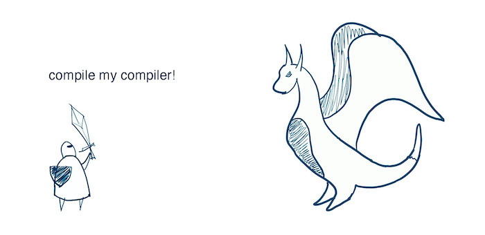

外はとてもいい天気なので、コンパイラーを作ってみよう。コンパイラの仕組みについての知識は必要ありません。Pythonを使って独自のプログラミング言語Teeny Tinyを実装し、Cコードにコンパイルする。約500行のコードで、コンパイラをカスタマイズして拡張し、10億ドル規模の量産可能な独自のコンパイラにするために必要な初期インフラを提供する。

このチュートリアルは、動作するコンパイラーを構築するためのステップ・バイ・ステップの一連の投稿である。すべてのソースコードはGitHubの[repo](https://github.com/AZHenley/teenytinycompiler)にあります。すべての投稿をフォローしても、数時間しかかからないと思います。

私たちが実装しようとしているTeeny Tiny言語は、[BASIC](https://en.wikipedia.org/wiki/BASIC)の方言です。構文はきれいでシンプルです。もし[C](https://en.wikipedia.org/wiki/C_(programming_language))のような構文がお好みなら、最後にコンパイラを修正するのは簡単です。以下はTeeny Tiny言語でのプログラム例です：

``` prettyprint
PRINT "How many fibonacci numbers do you want?"
INPUT nums

LET a = 0
LET b = 1
WHILE nums > 0 REPEAT
    PRINT a
    LET c = a + b
    LET a = b
    LET b = c
    LET nums = nums - 1
ENDWHILE    
```

このプログラムはユーザーの入力に基づいてフィボナッチ数列の項を出力する： 0 1 1 2 3 5 8 13...

この言語では、プログラミング言語に期待されるさまざまな基本操作ができる。特に、以下のようなものをサポートする：

- 数値変数
- 基本的な算術演算
- If文
- Whileループ
- テキストと数値の印刷
- 数値の入力
- ラベルとgoto
- コメント

これは標準的な機能のサブセットだが、関数や配列、ファイルからの読み書き、else文さえないことにお気づきだろうか。しかし、この小さな構成要素セットだけで、実際には多くのことができる。また、コンパイラのセットアップも簡単なので、他の多くの機能を後から追加することも容易である。

### コンパイラの概要


私たちのコンパイラーは、上に示した3つのステップを踏む。 まず、入力されたソースコードが与えられると、そのコードを*トークン*に分割する。これは英語の単語や句読点のようなものだ。第2に、トークンを*解析*して、私たちの言語で許容される順序にあることを確認する。ちょうど英語の文章が動詞と名詞の特定の構造に従っているように。第三に、私たちの言語が翻訳するCコードを*生成*する。

この3つのステップをコードの主要な構成として使用する。LEXER, PARSER, EMITTERはそれぞれ独自のPythonコードファイルを持っています。 このチュートリアルはこれらのステップに基づいて3つの部分に分かれています。もしこのコンパイラを拡張するのであれば、さらにいくつかのステップを追加することになるでしょうが、それについては触れないでおきます。

### Lexerの概要

コンパイラの最初のモジュールは*lexer*と呼ばれる。Teeny Tinyコードの文字列が与えられると、レキサーは1文字ずつ繰り返し処理を行い、2つのことを行います。もしレキサーがこれを実行できなければ、無効なトークンであるとしてエラーを報告します。

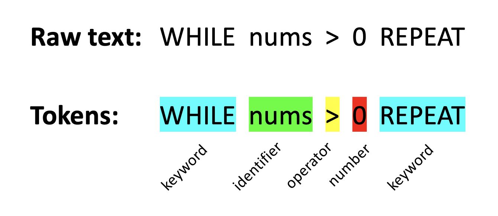

図は lexer の入力と出力の例を示している。Teeny Tinyのコードが与えられたら、レキサーはトークンがどこにあるか、タイプ（キーワードなど）とともに判断しなければならない。スペースはトークンとして認識されないことがわかりますが、レキサーはトークンの終わりを知る一つの方法としてスペースを使います。

いよいよコードに入りましょう。まず、**lex.py** ファイルの lexer の構造から始めます：

``` {.prettyprint .lang-python}
class Lexer:
    def __init__(self, source):
        pass

    # 次の文字を処理する。
    def nextChar(self):
        pass

    # 先読み文字を返す。
    def peek(self):
        pass

    # 無効なトークンが見つかりましたので、エラーメッセージを表示して終了します。
    def abort(self, message):
        pass
        
    # 改行以外の空白文字はスキップする（これは文の終わりを示すのに使う）。
    def skipWhitespace(self):
        pass
        
    # コード内のコメントをスキップする。
    def skipComment(self):
        pass

    # 次のトークンを返す。
    def getToken(self):
        pass
```

私は、必要と思われる関数をすべてスケッチし、それから戻って埋めていくのが好きだ。関数**getToken**はlexerの核となるものだ。この関数は、コンパイラが次のトークンの準備をするたびに呼び出され、トークンの分類を行います。**nextChar**と**peek**は、次の文字を探すためのヘルパー関数です。 **skipWhitespace**は、私たちが気にしないスペースとタブを消費します。**abort**は、無効なトークンを報告するために使用します。

lexerは、入力文字列の現在の位置とその位置の文字を追跡する必要があります。これらはコンストラクタで初期化します：

``` {.prettyprint .lang-python}
    def __init__(self, source):
        self.source = source + '\n' # ソースコードを文字列としてlexする。最後のトークン/ステートメントのレキシング/解析を簡略化するために、改行を追加してください。
        self.curChar = ''   # 文字列内の現在の文字。
        self.curPos = -1    # 文字列内の現在位置。
        self.nextChar()
```

レキサーは入力コードを必要とするので、それに改行を追加する（これは後のチェックを簡略化するためである）。**curChar**は、レキサがトークンの種類を決定するために常にチェックするものである。なぜ *source[curPos]* としないのですか？それは、境界チェックでコードが散らかるからだ。その代わりに、**nextChar**でこれを行う：

``` {.prettyprint .lang-python}
    # 次の文字を処理する。
    def nextChar(self):
        self.curPos += 1
        if self.curPos >= len(self.source):
            self.curChar = '\0'  # EOF
        else:
            self.curChar = self.source[self.curPos]
```

これはレキサーの現在位置をインクリメントし、現在の文字を更新する。入力の最後に達した場合は、その文字をファイル終了マーカーに設定します。curPosとcurCharを変更するのはここだけです。しかし、curPosを更新せずに、次の文字を先読みしたいこともあります：

``` {.prettyprint .lang-python}
    # 先読み文字を返す。
    def peek(self):
        if self.curPos + 1 >= len(self.source):
            return '\0'
        return self.source[self.curPos+1]
```

これらの関数が動作することを確認しましょう。新しいファイル **teenytiny.py** を作ってテストしてみましょう：

``` {.prettyprint .lang-python}
from lex import *

def main():
    source = "LET foobar = 123"
    lexer = Lexer(source)

    while lexer.peek() != '\0':
        print(lexer.curChar)
        lexer.nextChar()

main()
```

これを実行すると、入力文字列、*LET foobar = 123*の各文字が改行されて出力されるはずである：

``` prettyprint
L
E 
T 

f 
o 
o 
b 
a 
r 

= 

1 
2 
3 
```

### トークンの分類

しかし、私たちが欲しいのは単なる文字ではなく、トークンである！個々の文字をどのように組み合わせてトークンを作るかを計画する必要がある。以下は、Teeny Tiny言語の主なレキサーのルールです：

- 演算子。1 つまたは 2 つの連続した文字がマッチします： + - \* / = == != \> \< \>= \<=
- 文字列。ダブルクォーテーションの後に0個以上の文字とダブルクォーテーションが続くもの。次のようなものです： \"hello,world!˶"、"˶"など。
- 数字。1つまたは複数の数値文字の後にオプションの小数点と1つまたは複数の数値文字が続きます。例えば 15 および 3.14
- 識別子。アルファベット文字の後に0文字以上の英数字が続く。
- キーワード。完全に一致するテキスト： label、goto、print、input、let、if、then、endif、while、repeat、endwhile。

次に、**Lexer** クラスで **getToken** 関数を開始します：

``` {.prettyprint .lang-python}
    # Return the next token.
    def getToken(self):
        # このトークンの最初の文字をチェックして、それが何であるかを判断する。
        # もしそれが複数文字の演算子（例：!=）、数字、識別子、キーワードであれば、残りを処理する。
        if self.curChar == '+':
            pass    # Plus token.
        elif self.curChar == '-':
            pass    # Minus token.
        elif self.curChar == '*':
            pass    # Asterisk token.
        elif self.curChar == '/':
            pass    # Slash token.
        elif self.curChar == '\n':
            pass    # Newline token.
        elif self.curChar == '\0':
            pass    # EOF token.
        else:
            # Unknown token!
            pass
            
        self.nextChar()
```

これはいくつかの可能性のあるトークンを検出するが、まだ役に立つことは何もしない。次に必要なのは、トークンの種類とコードの正確なテキストを追跡するための **Token** クラスです。これをとりあえず **lex.py** に置きます：

``` {.prettyprint .lang-python}
# Token contains the original text and the type of token.
class Token:   
    def __init__(self, tokenText, tokenKind):
        self.text = tokenText   # The token's actual text. Used for identifiers, strings, and numbers.
        self.kind = tokenKind   # The TokenType that this token is classified as.
```

トークンのタイプを指定するために、enumとして**TokenType**クラスを作成します。長く見えますが、これは言語が許容する全てのトークンを指定します。*import enum* を **lex.py** の先頭に追加し、このクラスを追加します：

``` {.prettyprint .lang-python}
# TokenType は、トークンのすべてのタイプを表す列挙型です。
class TokenType(enum.Enum):
    EOF = -1
    NEWLINE = 0
    NUMBER = 1
    IDENT = 2
    STRING = 3
    # Keywords.
    LABEL = 101
    GOTO = 102
    PRINT = 103
    INPUT = 104
    LET = 105
    IF = 106
    THEN = 107
    ENDIF = 108
    WHILE = 109
    REPEAT = 110
    ENDWHILE = 111
    # Operators.
    EQ = 201  
    PLUS = 202
    MINUS = 203
    ASTERISK = 204
    SLASH = 205
    EQEQ = 206
    NOTEQ = 207
    LT = 208
    LTEQ = 209
    GT = 210
    GTEQ = 211
```

これで、**getToken**を拡張して、特定のトークンを検出したときに実際に何かを実行できるようになりました：

``` {.prettyprint .lang-python}
    # 次のトークンを返す。
    def getToken(self):
        token = None

        # このトークンの最初の文字をチェックして、それが何であるかを判断する。
        # もしそれが複数文字の演算子（例：!=）、数字、識別子、キーワードであれば、残りを処理する。
        if self.curChar == '+':
            token = Token(self.curChar, TokenType.PLUS)
        elif self.curChar == '-':
            token = Token(self.curChar, TokenType.MINUS)
        elif self.curChar == '*':
            token = Token(self.curChar, TokenType.ASTERISK)
        elif self.curChar == '/':
            token = Token(self.curChar, TokenType.SLASH)
        elif self.curChar == '\n':
            token = Token(self.curChar, TokenType.NEWLINE)
        elif self.curChar == '\0':
            token = Token('', TokenType.EOF)
        else:
            # Unknown token!
            pass
            
        self.nextChar()
        return token
```

このコードでは、基本的な算術演算子と改行、ファイル終了マーカーを検出するようにレキサーをセットアップしている。*else*節は、許可されないものをすべて検出するためのものである。

では、**main**を変更して、今のところうまくいっているかどうかを見てみよう：

``` {.prettyprint .lang-python}
def main():
    source = "+- */"
    lexer = Lexer(source)

    token = lexer.getToken()
    while token.kind != TokenType.EOF:
        print(token.kind)
        token = lexer.getToken()
```

これを実行すると、次のように表示されるはずだ：

``` prettyprint
TokenType.PLUS
TokenType.MINUS
Traceback (most recent call last):
  File "e:/projects/teenytiny/part1/teenytiny.py", line 12, in 
    main()
  File "e:/projects/teenytiny/part1/teenytiny.py", line 8, in main
    while token.kind != TokenType.EOF:
AttributeError: 'NoneType' object has no attribute 'kind'
```

ウホッ！何かが間違っていた。**getToken**が*None*を返す唯一の方法は、*else*ブランチが取られた場合だ。もう少しうまく処理しよう。 **import sys**を**lex.py**の先頭に追加し、**abort**関数を次のように定義します：

``` {.prettyprint .lang-python}
    # Invalid token found, print error message and exit.
    def abort(self, message):
        sys.exit("Lexing error. " + message)
```

そして、**getToken**の*else*を次のように置き換える：

``` {.prettyprint .lang-python}
        else:
            # Unknown token!
            self.abort("Unknown token: " + self.curChar)
```

もう一度プログラムを実行する

``` prettyprint
TokenType.PLUS
TokenType.MINUS
Lexing error. Unknown token: 
```

まだ問題はあるが、これで少しは理解できるようになった。 最初の2つのトークンの後、何かがおかしくなったようだ。未知のトークンは見えない。入力文字列を振り返ってみると、空白を処理していないことに気づくかもしれない！**skipWhitespace**関数を実装する必要があります：

``` {.prettyprint .lang-python}
    # 改行以外の空白文字はスキップする。
    def skipWhitespace(self):
        while self.curChar == ' ' or self.curChar == '\t' or self.curChar == '\r':
            self.nextChar()
```

ここで、**getToken**の最初の行に*self.skipWhitespace()*を記述する。プログラムを実行すると、出力が表示されます：

``` prettyprint
TokenType.PLUS
TokenType.MINUS
TokenType.ASTERISK
TokenType.SLASH
TokenType.NEWLINE
```

進展！

この時点で、*==* や *\>=* のような2つの文字で構成される演算子のレキシングに移 ることができる。これらの演算子はすべて同じ方法で字句解析される。最初の文字をチェックし、次に2番目の文字を見て、それが何であるかを確認してから、どうするかを決定する。**getToken**の *SLASH* トークンの *elif* の後にこれを追加する：

``` {.prettyprint .lang-python}
        elif self.curChar == '=':
            # このトークンが = か == かをチェックする
            if self.peek() == '=':
                lastChar = self.curChar
                self.nextChar()
                token = Token(lastChar + self.curChar, TokenType.EQEQ)
            else:
                token = Token(self.curChar, TokenType.EQ)
```

**peek**関数を使えば、*curChar*を破棄することなく、次の文字が何であるかを調べることができる。以下は、同じように動作する残りの演算子のコードである：

``` {.prettyprint .lang-python}
        elif self.curChar == '>':
            # このトークンが > か >= かをチェックする。
            if self.peek() == '=':
                lastChar = self.curChar
                self.nextChar()
                token = Token(lastChar + self.curChar, TokenType.GTEQ)
            else:
                token = Token(self.curChar, TokenType.GT)
        elif self.curChar == '<':
                # このトークンが < か <= かをチェックする。
                if self.peek() == '=':
                    lastChar = self.curChar
                    self.nextChar()
                    token = Token(lastChar + self.curChar, TokenType.LTEQ)
                else:
                    token = Token(self.curChar, TokenType.LT)
        elif self.curChar == '!':
            if self.peek() == '=':
                lastChar = self.curChar
                self.nextChar()
                token = Token(lastChar + self.curChar, TokenType.NOTEQ)
            else:
                self.abort("Expected !=, got !" + self.peek())
```

唯一少し違うのは、*!=*という演算子である。これは、*!*文字が単独では無効であるため、*=*を続けなければならないからである。 他の文字は単独でも有効ですが、レキサーは貪欲なので、可能であれば複数文字演算子の1つとして受け入れます。

これらの演算子をテストするには、入力を*\"+- \*/ \>\>= = !=\"*に更新すればよい：

``` prettyprint
TokenType.PLUS
TokenType.MINUS
TokenType.ASTERISK
TokenType.SLASH
TokenType.GT
TokenType.GTEQ
TokenType.EQ
TokenType.NOTEQ
TokenType.NEWLINE
```

これでプログラムは、言語の演算子をすべて受け入れることができる。では、何が残っているのだろうか？コメント、文字列、数値、識別子、キーワードのサポートを追加する必要がある。ひとつひとつ確認しながらテストしていこう。

*\#* 文字はコメントの開始を示す。レキサーがこれを見るたびに、改行があるまで、それ以降のテキストをすべて無視することがわかる。 コメントはトークンではないが、レキサーはこのテキストをすべて捨てて、次に気になるものを見つけられるようにする。また、コメント末尾の改行を捨てないことも重要です。改行はそれ自体がトークンであり、まだ必要な場合があるからです。**skipComment**に埋めてください：

``` {.prettyprint .lang-python}
    # コード内のコメントをスキップする。
    def skipComment(self):
        if self.curChar == '#':
            while self.curChar != '\n':
                self.nextChar()
```

簡単だ！さて、この関数を**nextToken**から呼び出すと、関数の最初の数行は次のようになる：

``` {.prettyprint .lang-python}
    # 次のトークンを返す。
    def getToken(self):
        self.skipWhitespace()
        self.skipComment()
        token = None
    ...
```

試しに*\"+- \# This is a comment!\\n \*/\”*と入力すると次のような結果を見るでしょう。

``` prettyprint
TokenType.PLUS
TokenType.MINUS
TokenType.NEWLINE
TokenType.ASTERISK
TokenType.SLASH
TokenType.NEWLINE
```

このコメントは完全に無視さ れていることに注意してほしい！

この言語では、ダブルクォーテーションで始まり、もう1つのクォーテーションまで続く文字列を印刷することができます。後でCにコンパイルしやすくするために、いくつかの特殊文字は許さないことにする。**getToken**の大きなelse if文のブロックに次のコードを追加する：

``` {.prettyprint .lang-python}
        elif self.curChar == '\"':
            # クォーテーションの間の文字列を取得する。
            self.nextChar()
            startPos = self.curPos

            while self.curChar != '\"':
                # 文字列中の特殊文字を許可しない。エスケープ文字、改行、タブ、%は禁止。
                # この文字列にはC言語のprintfを使用します。
                if self.curChar == '\r' or self.curChar == '\n' or self.curChar == '\t' or self.curChar == '\\' or self.curChar == '%':
                    self.abort("Illegal character in string.")
                self.nextChar()

            tokText = self.source[startPos : self.curPos] # 部分文字列を取得する。
            token = Token(tokText, TokenType.STRING)
```

このコードは単なるwhileループで、2つ目のクォーテーション・マークまで続く。無効な文字が見つかった場合は、エラーメッセージとともに中断されます。これまで取り上げた他のトークンとは何かが違います。トークンのテキストを文字列の内容（引用符を除く）に設定します。

入力を再度*\"+- \\\"This is a string\\\" \# This is a comment!\\n \*/\"*で更新し、プログラムを実行する：

``` prettyprint
TokenType.PLUS
TokenType.MINUS
TokenType.STRING
TokenType.NEWLINE
TokenType.ASTERISK
TokenType.SLASH
TokenType.NEWLINE
```

Moving right along to numbers. Our language defines a number as one or more digits (0-9) followed by an optional decimal point that must be followed by at least one digit. So 48 and 3.14 are allowed but .9 and 1.  are not allowed. We will use the **peek** function again to look ahead one character. Similar to the string token, we keep track of the start and end points of the numbers so that we can set the token's text to the actual number.

``` {.prettyprint .lang-python}
        elif self.curChar.isdigit():
            # Leading character is a digit, so this must be a number.
            # Get all consecutive digits and decimal if there is one.
            startPos = self.curPos
            while self.peek().isdigit():
                self.nextChar()
            if self.peek() == '.': # Decimal!
                self.nextChar()

                # Must have at least one digit after decimal.
                if not self.peek().isdigit(): 
                    # Error!
                    self.abort("Illegal character in number.")
                while self.peek().isdigit():
                    self.nextChar()

            tokText = self.source[startPos : self.curPos + 1] # Get the substring.
            token = Token(tokText, TokenType.NUMBER)
```

Test it out with the input *\"+-123 9.8654\*/\"* and you should see:

``` prettyprint
TokenType.PLUS
TokenType.MINUS
TokenType.NUMBER
TokenType.NUMBER
TokenType.ASTERISK
TokenType.SLASH
TokenType.NEWLINE
```

Great, we are almost done with the lexer!

The last big thing is to handle identifiers and keywords. The rules for an identifier is anything that starts with a alphabetic characters followed by zero or more alphanumeric characters. But before we call it a *TokenType.IDENT*, we have to make sure it isn't one of our keywords.  Add this to **getToken**:

``` {.prettyprint .lang-python}
        elif self.curChar.isalpha():
            # Leading character is a letter, so this must be an identifier or a keyword.
            # Get all consecutive alpha numeric characters.
            startPos = self.curPos
            while self.peek().isalnum():
                self.nextChar()

            # Check if the token is in the list of keywords.
            tokText = self.source[startPos : self.curPos + 1] # Get the substring.
            keyword = Token.checkIfKeyword(tokText)
            if keyword == None: # Identifier
                token = Token(tokText, TokenType.IDENT)
            else:   # Keyword
                token = Token(tokText, keyword)
```

Fairly similar to the other tokens. But we need to define **checkIfKeyword** in the **Token** class:

``` {.prettyprint .lang-python}
    @staticmethod
    def checkIfKeyword(tokenText):
        for kind in TokenType:
            # Relies on all keyword enum values being 1XX.
            if kind.name == tokenText and kind.value >= 100 and kind.value < 200:
                return kind
        return None
```

This just checks whether the token is in the list of keywords, which we have arbitrarily set to having 101-199 as their enum values.

Alright, test identifiers and keywords with the input string *\"IF+-123 foo\*THEN/\"*

``` prettyprint
TokenType.IF
TokenType.PLUS
TokenType.MINUS
TokenType.NUMBER
TokenType.IDENT
TokenType.ASTERISK
TokenType.THEN
TokenType.SLASH
TokenType.NEWLINE
```

And what the output looks like from the terminal:

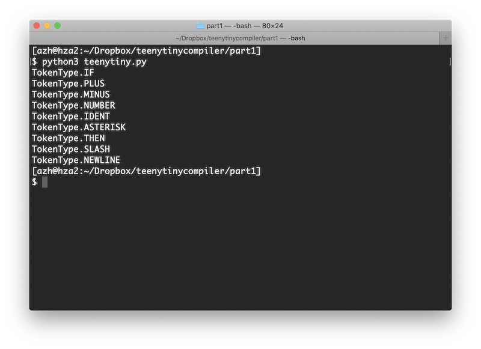{.center style="max-width:75%;"}

There we have it. Our lexer can correctly identify every token that our language needs! We have successfully completed the first module of our compiler.

If you think this is underwhelming, don't give up yet! I think the lexer is actually the most tedious yet least interesting part of compilers. Next up we will *parse* the code, that is make sure the tokens are in an order that makes sense, and then we will *emit* code.

The source code so far can be found in its entirety in the Github [repo](https://github.com/AZHenley/teenytinycompiler).

------------------------------------------------------------------------

Continue on to [part 2](teenytinycompiler2.html) of this tutorial. Other recommended reading:

-   Lexical analysis ([Wikipedia](https://en.wikipedia.org/wiki/Lexical_analysis))
-   Writing an Interpreter in Go ([Amazon](https://amzn.to/2Saf28j))
-   Crafting Interpreters ([Amazon](https://amzn.to/3l8FePX), [web](https://craftinginterpreters.com/contents.html))


# Teeny Tinyコンパイラーを作ろう、その2

[6/5/2020]{.small}\
\
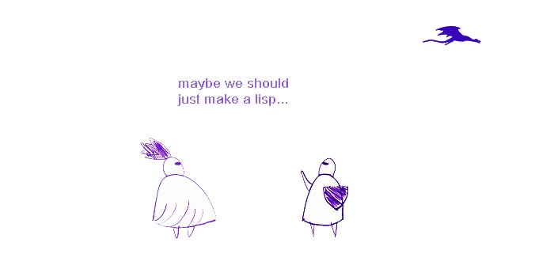{.center style="max-width:60%;border:1px solid black;"}

It is a rainy day outside, so let's continue working on our Teeny Tiny compiler. Go read [part 1](teenytinycompiler1.html) if you haven't already, and don't forget that the source code can be found in the GitHub [repo](https://github.com/AZHenley/teenytinycompiler). This part of the tutorial does need a bit of upfront explanation, but I hope you stick with it because we are well on our way to completing our compiler!

To recap, we are making a compiler for our own programming language, Teeny Tiny. The compiler will work in three stages: (1) *lexing*, which breaks the input code up into small pieces called tokens, (2) *parsing*, which verifies that the tokens are in an order that our language allows, and (3) *emitting*, which produces the appropriate C code. We finished the lexer in [part 1](teenytinycompiler1.html), so now we will be focusing on the parser.

### Parser Overview

The parser is the component that will make sure the code follows the correct syntax. It does this by looking at the tokens, one at a time, and deciding if the ordering is legal as defined by our language.

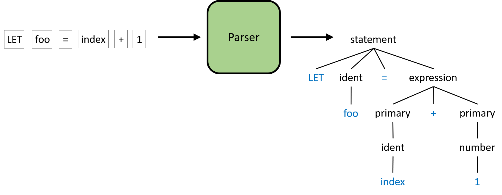{.center style="max-width:85%;"}

The figure above is a slightly simplified example of what the parser will do. The input to the parser is the sequence of tokens and the output is the parse tree. A parse tree is a more structured representation of the code than just a text string or a sequence of tokens. The process to create this tree will be discussed in the remainder of this post. I know trees can sometimes be scary, but we won't be building any complicated data structure for this. Rather, we will utilize the *call stack* of our parser to implicitly build the parse tree as we go.

Before we can verify the code's structure or build the parse tree though, we need to know what structures Teeny Tiny allows...

### Grammar Overview

Teeny Tiny needs a grammar. This is a formal way to describe all of the code that is legal in Teeny Tiny. If you've ever had a compiler yell at you about a syntax error, it is because your code did not follow the language's grammar.

This isn't too different than when you learned about English. Take a look at this example of an English sentence and the corresponding parse tree:

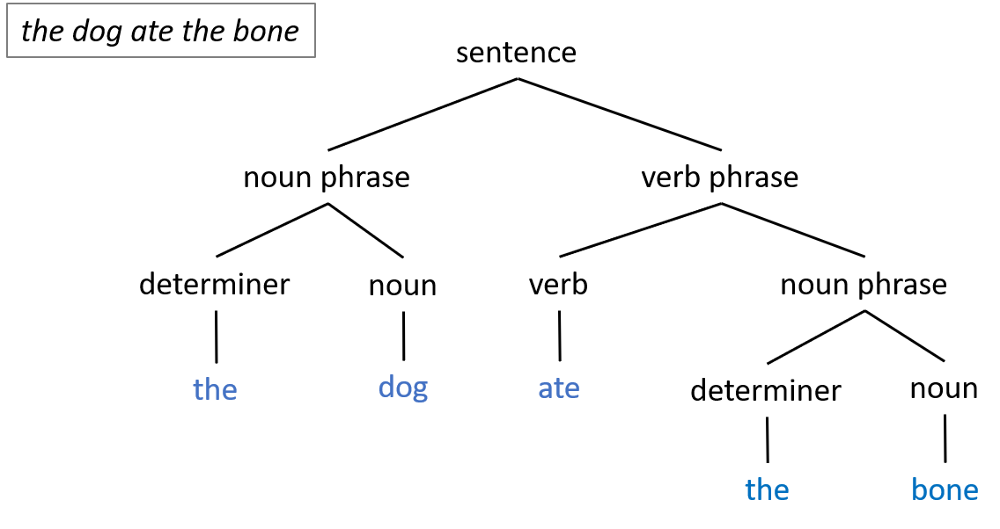{.center style="max-width:75%;"}

The parser will perform a similar process to Teeny Tiny code.

Alright, so how do we come up with the grammar for a language? This is partially creative and partially technical. A lot of syntax is more of a stylistic choice than anything. You can even look up the formal grammar for most programming languages. Grammars are usually written in a standard notation, but the specifics of the notation don't really matter right now. We just want to be able to implement our parser.

Here is a piece of Teeny Tiny's grammar:

``` prettyprint
program ::= {statement}
```

This reads as: there is a grammar rule named program that is made up of zero or more statement. What is a statement? It is another grammar rule:

``` prettyprint
statement ::= "PRINT" (expression | string) nl
```

The *statement* rule here is defined as the PRINT keyword followed by either an expression or a string and then a newline. *expression* and *nl* are other grammar rules that we are referencing. *string* is a type of token from the lexer.

We can expand the *statement* rule to have multiple options, like so:

``` prettyprint
statement ::= "PRINT" (expression | string) nl
    | "LET" ident "=" expression nl
```

Now the *statement* rule here is defined as one of two options: either a PRINT statement or a LET statement (the pipe symbol, `|`, means *or*). A LET statement is for assigning a value to a variable. It is defined as the LET keyword followed by an ident and a \"=\" then an expression and a newline. *ident* is a type of token from the lexer, which is a variable identifier. *expression* is another grammar rule which is for math expressions.

The rules tend to start very general and get more specific. Just like the English parse tree example from before. Let's examine one more type of statement...

``` prettyprint
statement ::= "PRINT" (expression | string) nl
    | "LET" ident "=" expression nl
    | "IF" comparison "THEN" nl {statement} "ENDIF" nl
```

Now our language also allows for *IF* statements. The important thing to notice with this rule is that it is recursive. The *statement* rule actually references the *statement* rule. This is the power of programming languages!

Here is the entire grammar for our Teeny Tiny programming language:

``` prettyprint
program ::= {statement}
statement ::= "PRINT" (expression | string) nl
    | "IF" comparison "THEN" nl {statement} "ENDIF" nl
    | "WHILE" comparison "REPEAT" nl {statement} "ENDWHILE" nl
    | "LABEL" ident nl
    | "GOTO" ident nl
    | "LET" ident "=" expression nl
    | "INPUT" ident nl
comparison ::= expression (("==" | "!=" | ">" | ">=" | "<" | "<=") expression)+
expression ::= term {( "-" | "+" ) term}
term ::= unary {( "/" | "*" ) unary}
unary ::= ["+" | "-"] primary
primary ::= number | ident
nl ::= '\n'+
```

You don't need to understand all of it just yet, we will be working through it piece by piece. The magic is that when implementing the parser, each of these grammar rules will get their own function in the Python code. It is a one-to-one mapping from grammar to code.

If you'd like to know a bit more about this notation... *{}* means zero or more, *\[\]* means zero or one, *+* means one or more of whatever is to the left, *()* is just for grouping, and *`|`* is a *logical or*. Words are either references to other grammar rules or to tokens that we have already defined in our lexer. I denote keywords and operators as quoted strings of text.

Given this grammar, our parser will produce trees like:

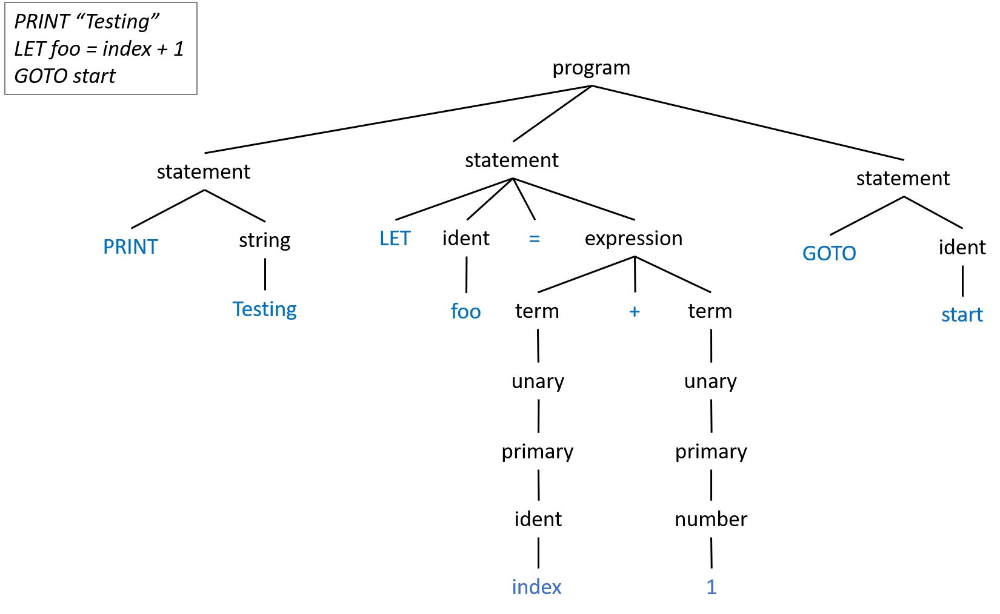{.center style="max-width:90%;"}

As you might imagine, even small programs will generate very large parse trees. That is ok! We will make the parser do the hard work! (Note: In the above example I omitted the newline rule from the trees to make it a bit smaller.)

Ok, let's finally get into the code!

### Code Setup

We need to setup the **main** function to use our soon to exist parser.  Update **teenytiny.py** with:

``` {.prettyprint .lang-python}
from lex import *
from parse import *
import sys

def main():
    print("Teeny Tiny Compiler")

    if len(sys.argv) != 2:
        sys.exit("Error: Compiler needs source file as argument.")
    with open(sys.argv[1], 'r') as inputFile:
        source = inputFile.read()

    # Initialize the lexer and parser.
    lexer = Lexer(source)
    parser = Parser(lexer)

    parser.program() # Start the parser.
    print("Parsing completed.")

main()
```

The compiler will now expect a filename as a command line argument to open for input. The parser object will control the lexer and request a new token as needed. So next, we have to implement the parser object.

Create **parse.py** and start with:

``` {.prettyprint .lang-python}
import sys
from lex import *

# Parser object keeps track of current token and checks if the code matches the grammar.
class Parser:
    def __init__(self, lexer):
        pass

    # Return true if the current token matches.
    def checkToken(self, kind):
        pass

    # Return true if the next token matches.
    def checkPeek(self, kind):
        pass

    # Try to match current token. If not, error. Advances the current token.
    def match(self, kind):
        pass

    # Advances the current token.
    def nextToken(self):
        pass

    def abort(self, message):
        sys.exit("Error. " + message)
```

Like I mentioned in the previous post, I like to sketch out all of the methods that I think I need then fill them in.

The **checkToken** and **checkPeek** functions will let the parser decide which grammar rule to apply next given the current token or the next one. Add these functions to the **Parser** class:

``` {.prettyprint .lang-python}
    # Return true if the current token matches.
    def checkToken(self, kind):
        return kind == self.curToken.kind

    # Return true if the next token matches.
    def checkPeek(self, kind):
        return kind == self.peekToken.kind
```

In the cases that the parser already knows which grammar rule to apply, we will use the **match** function. It expects the current token to be something specific or else it will produce an error. In other cases, such as when **checkToken** is used, we just want to skip to the next token with **nextToken**.

``` {.prettyprint .lang-python}
    # Try to match current token. If not, error. Advances the current token.
    def match(self, kind):
        if not self.checkToken(kind):
            self.abort("Expected " + kind.name + ", got " + self.curToken.kind.name)
        self.nextToken()

    # Advances the current token.
    def nextToken(self):
        self.curToken = self.peekToken
        self.peekToken = self.lexer.getToken()
        # No need to worry about passing the EOF, lexer handles that.
```

The parser also needs to be initialized. Here is the code for **\_\_init\_\_**:

``` {.prettyprint .lang-python}
    def __init__(self, lexer):
        self.lexer = lexer

        self.curToken = None
        self.peekToken = None
        self.nextToken()
        self.nextToken()    # Call this twice to initialize current and peek.
```

We will test everything momentarily.

Now that we have the core mechanics of the parser done, we now need to actually parse our language. We do this by mapping our grammar to code.  For each rule in our grammar, we have a matching function in the parser.  Remember how we wanted to turn our code into a tree structure? The call graph of the parsing functions that we will implement next will do that.

### Parsing Statements

We are going to go through our grammar and implement a function for each rule, one by one. When the rule references another rule, we call that function. When the rule expects a specific token, we call **match** and when there are multiple options, we call **checkToken**. We will start by parsing statements, like PRINT, before moving on to parsing math expressions.

First, let's implement **program**. This function kicks off the parser and is the parent rule in our grammar. So let's refer back to the first line of our grammar:

``` prettyprint
program ::= {statement}
```

This line just means that the program is made up of 0 or more statements. To map this to code, add the following code to the end of the **parser** class:

``` {.prettyprint .lang-python}
    # Production rules.

    # program ::= {statement}
    def program(self):
        print("PROGRAM")

        # Parse all the statements in the program.
        while not self.checkToken(TokenType.EOF):
            self.statement()
```

Just like our grammar says: this will continue to call **statement** until there is nothing left. See how easy that was to translate? To make it easier to know what the parser is doing, we will be printing from each function.

The next rule in our grammar is **statement**, which actually allows for 7 different types of rules. It is the biggest function in our parser, but it is straight forward if we break it up piece by piece. Inside of the function we will have an *if* condition for each of the 7 different statements. Here is the grammar for the first type of statement:

``` prettyprint
statement ::= "PRINT" (expression | string) nl
```

This statement expects a \"PRINT\" token first. Then one of two things can follow: either a math expression or a string token. Lastly, it expects a newline. Add this code to the **parser** class:

``` {.prettyprint .lang-python}
    # One of the following statements...
    def statement(self):
        # Check the first token to see what kind of statement this is.

        # "PRINT" (expression | string)
        if self.checkToken(TokenType.PRINT):
            print("STATEMENT-PRINT")
            self.nextToken()

            if self.checkToken(TokenType.STRING):
                # Simple string.
                self.nextToken()
            else:
                # Expect an expression.
                self.expression()

        # Newline.
        self.nl()
```

To make it easier to test, we can go ahead and implement the **nl** function that handles newlines. We will call this at the end of the **statement** function, since it applies to all statements. It works by expecting at least one newline character, but allows for more. Add this function to the **parser** class:

``` {.prettyprint .lang-python}
    # nl ::= '\n'+
    def nl(self):
        print("NEWLINE")
        
        # Require at least one newline.
        self.match(TokenType.NEWLINE)
        # But we will allow extra newlines too, of course.
        while self.checkToken(TokenType.NEWLINE):
            self.nextToken()
```

Time to test! Create a file, **hello.teeny**, to use as input to the compiler with *PRINT \"hello, world!\"* as the contents. Run **teenytiny.py** with the input file as an argument and you should get:

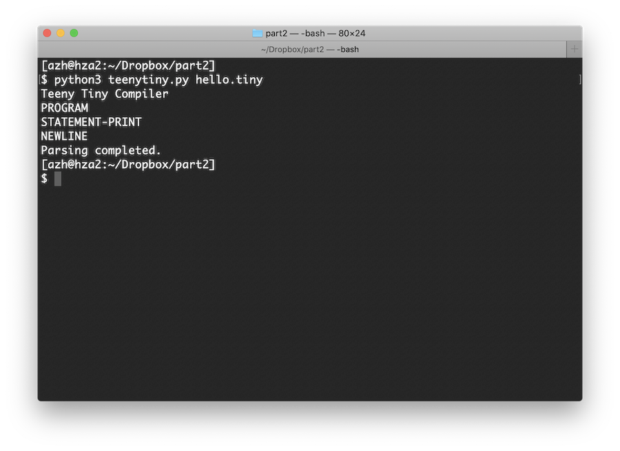{.center style="max-width:75%;"}

It works! Our one line of Teeny Tiny code is parsed successfully. Let's try with multiple PRINT statements. Update the input code to:

``` prettyprint
PRINT "hello, world!"
PRINT "second line"
PRINT "and a third..."
```

Rerun the program. You should see:

``` prettyprint
Teeny Tiny Compiler
PROGRAM
STATEMENT-PRINT
NEWLINE
STATEMENT-PRINT
NEWLINE
STATEMENT-PRINT
NEWLINE
Parsing completed.
```

Fantastic! Moving on to the next type of statement, the grammar is as follows:

``` prettyprint
    | "IF" comparison "THEN" nl {statement} "ENDIF" nl
```

This line starts with an *or*, so it is a continuation from the previous line in the grammar, and then expects an \"IF\" token. Next it refers to another grammar rule, **comparison**, which we will define as a function later. It will allow for the condition, like *foo \> 5*. After that the language expects a \"THEN\" token followed by a newline. Then comes the body of the *if* statement, which allows for 0 or more statements.  Lastly, it ends with an \"ENDIF\" token and a newline. Append this *elif* to the *if* in the **statement** function:

``` {.prettyprint .lang-python}
        # "IF" comparison "THEN" {statement} "ENDIF"
        elif self.checkToken(TokenType.IF):
            print("STATEMENT-IF")
            self.nextToken()
            self.comparison()

            self.match(TokenType.THEN)
            self.nl()

            # Zero or more statements in the body.
            while not self.checkToken(TokenType.ENDIF):
                self.statement()

            self.match(TokenType.ENDIF)
```

Make sure *self.nl()* is still at the end of the **statement** function.  We can't test this just yet, so we will move on to the next grammar rule, which is for the *while* loop. The grammar looks almost identical to the *if* statement that we just did.

``` prettyprint
    | "WHILE" comparison "REPEAT" nl {statement nl} "ENDWHILE" nl
```

And the code looks similar too. Remember, this is still part of the **statement** function that we are adding to:

``` {.prettyprint .lang-python}
        # "WHILE" comparison "REPEAT" {statement} "ENDWHILE"
        elif self.checkToken(TokenType.WHILE):
            print("STATEMENT-WHILE")
            self.nextToken()
            self.comparison()

            self.match(TokenType.REPEAT)
            self.nl()

            # Zero or more statements in the loop body.
            while not self.checkToken(TokenType.ENDWHILE):
                self.statement()

            self.match(TokenType.ENDWHILE)
```

You probably see the pattern at this point. The remaining forms of *statement* are also almost identical to each other:

``` prettyprint
    | "LABEL" ident nl
    | "GOTO" ident nl
    | "LET" ident "=" expression nl
    | "INPUT" ident nl
```

This is the last bit of code for the **statement** function:

``` {.prettyprint .lang-python}
        # "LABEL" ident
        elif self.checkToken(TokenType.LABEL):
            print("STATEMENT-LABEL")
            self.nextToken()
            self.match(TokenType.IDENT)

        # "GOTO" ident
        elif self.checkToken(TokenType.GOTO):
            print("STATEMENT-GOTO")
            self.nextToken()
            self.match(TokenType.IDENT)

        # "LET" ident "=" expression
        elif self.checkToken(TokenType.LET):
            print("STATEMENT-LET")
            self.nextToken()
            self.match(TokenType.IDENT)
            self.match(TokenType.EQ)
            self.expression()

        # "INPUT" ident
        elif self.checkToken(TokenType.INPUT):
            print("STATEMENT-INPUT")
            self.nextToken()
            self.match(TokenType.IDENT)

        # This is not a valid statement. Error!
        else:
            self.abort("Invalid statement at " + self.curToken.text + " (" + self.curToken.kind.name + ")")

        # Newline.
        self.nl()
```

Notice the *else* at the end. If the parser is expecting a statement, but doesn't match any of the 7 types that we defined, it should throw an error.

Time for some testing. Update the input file to:

``` prettyprint
LABEL loop
PRINT "hello, world!"
GOTO loop
```

Running this should output:

``` prettyprint
Teeny Tiny Compiler
PROGRAM
STATEMENT-LABEL
NEWLINE
STATEMENT-PRINT
NEWLINE
STATEMENT-GOTO
NEWLINE
Parsing completed.
```

We should also try breaking the parser. Try a nonsensical input that won't be parsed by any of the statement forms that we implemented, like *\"JUMP GOTO\"*, which should show:

``` prettyprint
Teeny Tiny Compiler
PROGRAM
Error! Invalid statement at JUMP (IDENT)
```

One quick thing before we move on. The **program** function currently can't handle newlines at the start of the input, but it is easy to fix that:

``` {.prettyprint .lang-python}
    # program ::= {statement}
    def program(self):
        print("PROGRAM")

        # Since some newlines are required in our grammar, need to skip the excess.
        while self.checkToken(TokenType.NEWLINE):
            self.nextToken()

        # Parse all the statements in the program.
        while not self.checkToken(TokenType.EOF):
            self.statement()
```

### Parsing Expressions

The parser is really coming together! We have implemented about half of the language now. We are missing *expressions*. An expression is something that can be evaluated to a value, like a math expression, *1+5\*3*, or a boolean expression, *foo\>=10*. Here is the grammar relevant to expressions:

``` prettyprint
comparison ::= expression (("==" | "!=" | ">" | ">=" | "<" | "<=") expression)+
expression ::= term {( "-" | "+" ) term}
term ::= unary {( "/" | "*" ) unary}
unary ::= ["+" | "-"] primary
primary ::= number | ident
```

This portion of the grammar may look strange or overly complicated to a reader. Why split it up into these 5 rules? Why not do something like... *expression ::= primary {operator primary}*? The answer is *precedence*.

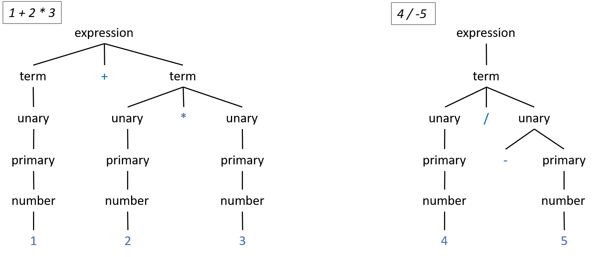{.center style="max-width:85%;"}

To achieve different levels of precedence, we organize the grammar rules sequentially. Operators with higher precedence need to be \"lower\" in the grammar, such that they are lower in the parse tree. The operators closest to the tokens in the parse tree (i.e., closest to the leaves of the tree) will have the highest precedence. Another way to think about it is how tightly the operators bind to the operands. When parsing, if there is not an operator at a given level, then it passes through to the next level and creates a node in the tree with only one child.

By doing this, it enforces the order of operations that you might expect from a math expression. *1+2\*3* should evaluate to 7, not 9. Looking at our grammar rules, the unary + and - operators are \"lower\" in our grammar, so they will have higher precedence than \* and /, which have higher precedence than the binary + and - operators. The parse trees above illustrate this. The multiplication operator will always be lower in the tree than the plus operator. The unary negation operator will be even lower. If there are more operators with the same precedence, then they will be processed left to right. More precedence levels (and operators) can be added by following this pattern.

The *comparison* rule is a bit different. We don't want comparison operators (e.g., !=) to be allowed in math expressions. So to control where they are allowed (i.e., IF statements and WHILE loops), we have a special rule for them that requires at least one comparison operator. On the left and right hand side of the comparison operator is an *expression*. Now any place we allow only math expressions, we expect *expression*, and any place we allow boolean expressions, we expect *comparison*. The code for **comparison** is:

``` {.prettyprint .lang-python}
    # comparison ::= expression (("==" | "!=" | ">" | ">=" | "<" | "<=") expression)+
    def comparison(self):
        print("COMPARISON")

        self.expression()
        # Must be at least one comparison operator and another expression.
        if self.isComparisonOperator():
            self.nextToken()
            self.expression()
        else:
            self.abort("Expected comparison operator at: " + self.curToken.text)

        # Can have 0 or more comparison operator and expressions.
        while self.isComparisonOperator():
            self.nextToken()
            self.expression()
```

To make the code easier to read, I created the **isComparisonOperator**:

``` {.prettyprint .lang-python}
    # Return true if the current token is a comparison operator.
    def isComparisonOperator(self):
        return self.checkToken(TokenType.GT) or self.checkToken(TokenType.GTEQ) or self.checkToken(TokenType.LT) or self.checkToken(TokenType.LTEQ) or self.checkToken(TokenType.EQEQ) or self.checkToken(TokenType.NOTEQ)
```

The code for expression:

``` {.prettyprint .lang-python}
    # expression ::= term {( "-" | "+" ) term}
    def expression(self):
        print("EXPRESSION")

        self.term()
        # Can have 0 or more +/- and expressions.
        while self.checkToken(TokenType.PLUS) or self.checkToken(TokenType.MINUS):
            self.nextToken()
            self.term()
```

The code for term and unary:

``` {.prettyprint .lang-python}
    # term ::= unary {( "/" | "*" ) unary}
    def term(self):
        print("TERM")

        self.unary()
        # Can have 0 or more *// and expressions.
        while self.checkToken(TokenType.ASTERISK) or self.checkToken(TokenType.SLASH):
            self.nextToken()
            self.unary()


    # unary ::= ["+" | "-"] primary
    def unary(self):
        print("UNARY")

        # Optional unary +/-
        if self.checkToken(TokenType.PLUS) or self.checkToken(TokenType.MINUS):
            self.nextToken()        
        self.primary()
```

Finally, the last piece of our grammar. A primary is either a number token or an ident token, which is a variable name. The code:

``` {.prettyprint .lang-python}
    # primary ::= number | ident
    def primary(self):
        print("PRIMARY (" + self.curToken.text + ")")

        if self.checkToken(TokenType.NUMBER): 
            self.nextToken()
        elif self.checkToken(TokenType.IDENT):
            self.nextToken()
        else:
            # Error!
            self.abort("Unexpected token at " + self.curToken.text)
```

Ready to test expressions??? Put *LET foo = bar \* 3 + 2* in your input file and run:

``` prettyprint
Teeny Tiny Compiler
PROGRAM
STATEMENT-LET
EXPRESSION
TERM
UNARY
PRIMARY (bar)
UNARY
PRIMARY (3)
TERM
UNARY
PRIMARY (2)
NEWLINE
Parsing completed.
```

Now try:

``` prettyprint
LET foo = bar * 3 + 2
IF foo > 0 THEN
    PRINT "yes!"
ENDIF
```

Which should have the quite long output of:

``` prettyprint
Teeny Tiny Compiler
PROGRAM
STATEMENT-LET
EXPRESSION
TERM
UNARY
PRIMARY (bar)
UNARY
PRIMARY (3)
TERM
UNARY
PRIMARY (2)
NEWLINE
STATEMENT-IF
COMPARISON
EXPRESSION
TERM
UNARY
PRIMARY (foo)
EXPRESSION
TERM
UNARY
PRIMARY (0)
NEWLINE
STATEMENT-PRINT
NEWLINE
NEWLINE
Parsing completed.
```

The parser allows nested loops and if statements too. Try it out.

``` prettyprint
LET foo = bar * 3 + 2
IF foo > 0 THEN
    IF 10 * 10 < 100 THEN
        PRINT bar
    ENDIF
ENDIF
```

Yay! Everything parses!

### Checking Validity

Let's do more tests before we go for a victory lap. Run this Teeny Tiny code:

``` prettyprint
PRINT index
GOTO main
```

So even though our input code conforms to the grammar, it is nonsensical. We are attempting to PRINT an undeclared variable and GOTO an undeclared label. The compiler should do something about this! As we are parsing, the compiler can keep track of which variables and labels have been declared as well as which labels have been goto'ed. If an undeclared variable is referenced, it can print an error. At the end of parsing, it can also check to make sure that all labels have been declared. Since labels can be goto'ed before they are referenced, we will keep track of both labels and gotos.

Update **\_\_init\_\_** to initialize three sets:

``` {.prettyprint .lang-python}
    def __init__(self, lexer):
        self.lexer = lexer

        self.symbols = set()    # Variables declared so far.
        self.labelsDeclared = set() # Labels declared so far.
        self.labelsGotoed = set() # Labels goto'ed so far.

        self.curToken = None
        self.peekToken = None
        self.nextToken()
        self.nextToken()    # Call this twice to initialize current and peek.
```

Now when we parse a *label* or *goto* statement, we should update the sets. Replace the code for label and goto in the **statement** function with:

``` {.prettyprint .lang-python}
        # "LABEL" ident
        elif self.checkToken(TokenType.LABEL):
            print("STATEMENT-LABEL")
            self.nextToken()

            # Make sure this label doesn't already exist.
            if self.curToken.text in self.labelsDeclared:
                self.abort("Label already exists: " + self.curToken.text)
            self.labelsDeclared.add(self.curToken.text)

            self.match(TokenType.IDENT)

        # "GOTO" ident
        elif self.checkToken(TokenType.GOTO):
            print("STATEMENT-GOTO")
            self.nextToken()
            self.labelsGotoed.add(self.curToken.text)
            self.match(TokenType.IDENT)
```

The way this works is that if a label already exists in *labelsDeclared*, then it means the code is attempting to declare it twice. That is not allowed, so the compiler aborts with an error message. If it doesn't already exist, then add it to the set. Whenever GOTO is parsed, insert the label into *labelsGotoed*. This can occur multiple times.

To verify that there is not a GOTO to an undeclared label, we need to update **program**. Once the parsing is complete, the compiler just needs to ensure that all of the labels in *labelsGotoed* are also in *labelsDeclared*.

``` {.prettyprint .lang-python}
    # program ::= {statement}
    def program(self):
        print("PROGRAM")

        # Since some newlines are required in our grammar, need to skip the excess.
        while self.checkToken(TokenType.NEWLINE):
            self.nextToken()

        # Parse all the statements in the program.
        while not self.checkToken(TokenType.EOF):
            self.statement()

        # Check that each label referenced in a GOTO is declared.
        for label in self.labelsGotoed:
            if label not in self.labelsDeclared:
                self.abort("Attempting to GOTO to undeclared label: " + label)
```

That takes care of labels. The last thing the parser needs to do is check that variables are declared. In a LET or INPUT statement, we will add it to a set of declared variables if it doesn't already exist. If a variable is referenced in an expression, the parser will check that it has been declared first.

Update LET in **statement**:

``` {.prettyprint .lang-python}
        # "LET" ident = expression
        elif self.checkToken(TokenType.LET):
            self.nextToken()

            #  Check if ident exists in symbol table. If not, declare it.
            if self.curToken.text not in self.symbols:
                self.symbols.add(self.curToken.text)

            self.match(TokenType.IDENT)
            self.match(TokenType.EQ)
            
            self.expression()
```

Update INPUT in **statement**:

``` {.prettyprint .lang-python}
        # "INPUT" ident
        elif self.checkToken(TokenType.INPUT):
            self.nextToken()

            #If variable doesn't already exist, declare it.
            if self.curToken.text not in self.symbols:
                self.symbols.add(self.curToken.text)

            self.match(TokenType.IDENT)
```

Then update **primary**:

``` {.prettyprint .lang-python}
    # primary ::= number | ident
    def primary(self):
        print("PRIMARY (" + self.curToken.text + ")")

        if self.checkToken(TokenType.NUMBER): 
            self.nextToken()
        elif self.checkToken(TokenType.IDENT):
            # Ensure the variable already exists.
            if self.curToken.text not in self.symbols:
                self.abort("Referencing variable before assignment: " + self.curToken.text)
            self.nextToken()
        else:
            # Error!
            self.abort("Unexpected token at " + self.curToken.text)
```

Those are the last changes to the parser! Now test it with the same input as last time and you should see...

``` prettyprint
Teeny Tiny Compiler
PROGRAM
STATEMENT-PRINT
EXPRESSION
TERM
UNARY
Error! Referencing variable before assignment: index
```

Now it reports an error, as it should.

Try running the compiler with one final input that is a bit more complex:

``` prettyprint
PRINT "How many fibonacci numbers do you want?"
INPUT nums
PRINT ""

LET a = 0
LET b = 1
WHILE nums > 0 REPEAT
    PRINT a
    LET c = a + b
    LET a = b
    LET b = c
    LET nums = nums - 1
ENDWHILE
```

:) Congratulations, our Teeny Tiny parser is complete! The output may not be pretty at the moment, but doing this has made it *very* easy for the next phase: emitting code. The source code can be found in the Github [repo](https://github.com/AZHenley/teenytinycompiler).

------------------------------------------------------------------------

Continue on to [part 3](teenytinycompiler3.html) of this tutorial to
learn how to emit code from the compiler. Other recommended reading:

-   Parsing ([Wikipedia](https://en.wikipedia.org/wiki/Parsing))
-   Writing an Interpreter in Go ([Amazon](https://amzn.to/2Saf28j))
-   Crafting Interpreters ([Amazon](https://amzn.to/3l8FePX),
    [web](https://craftinginterpreters.com/contents.html))

# Teeny Tinyコンパイラーを作ろう、その3

[7/5/2020]{.small}\
\
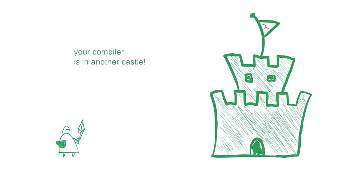{.center style="max-width:60%;border:1px solid black;"}

We are finally here. It is time to create the emitter for our Teeny Tiny compiler, which will give us the foundation to a working compiler. The fame and fortune is so close! Previously, we implemented the lexer ([part 1](teenytinycompiler1.html)) and the parser ([part 2](teenytinycompiler2.html)). The source code from this tutorial can be found in the GitHub [repo](https://github.com/AZHenley/teenytinycompiler).

The emitter is the component that will produce the compiled code. In this case, our compiler will be producing C code. Luckily, we designed our parser in such a way that will make emitting C code quite easy!  Since C is so ubiquitous, we will rely on your favorite C compiler (e.g., GCC or Clang) to produce the executable for us. This means our compiler will be platform independent without dealing with assembly code or complex compiler frameworks.

Back before I started coding this compiler, I wrote several fictitious examples of Teeny Tiny code and the corresponding C code that I think the compiler should generate. This was a good exercise to see which things translate nicely (i.e., one line of Teeny Tiny equals one line of C) and what doesn't.

Let's take a look at an example of Teeny Tiny code and the equivalent C code that we would like for our compiler to emit. The example is a program that calculates *nums* values of the Fibonacci sequence.


``` prettyprint
PRINT "How many fibonacci numbers do you want?"
INPUT nums
PRINT ""

LET a = 0
LET b = 1
WHILE nums > 0 REPEAT
    PRINT a
    LET c = a + b
    LET a = b
    LET b = c
    LET nums = nums - 1
ENDWHILE
```


``` {.prettyprint .lang-c}
#include <stdio.h>

int main(void){
    float nums, a, b, c;

    printf("How many fibonacci numbers do you want?\n");
    scanf("%f", &nums);
    printf("\n");

    a = 0;
    b = 1;
    while(nums>0){
        printf("%.2f\n", (float)(a));
        c = a+b;
        a = b;
        b = c;
        nums = nums-1;
    }
    
    return 0;
}
```


The above code *almost* translates line by line. Like *PRINT* turns into *printf*, *INPUT* to *scanf*, etc. You'll also notice there are other differences. The C code has a main function, includes a library, and returns 0 at the end. You'll also see that the C code has different syntax for variable declarations versus variable assignments (unlike our LET statement syntax which combines declarations and assignments) and that they are all declared at the top (this is an old C convention). It is these differences that our compiler needs to know about so that they can be handled accordingly. There are a few more that will come up later, but never fear, we can address them!

### Emitter Overview

So how does this emitter work??? In each function of the parser, we will call the emitter to produce the appropriate C code. The emitter is effectively just appending a bunch of strings together while following along the parse tree. For each grammar rule of Teeny Tiny, we will figure out how it should map to C code.

Below is an illustration of compiling a single line of Teeny Tiny code.  It shows each step of how the lexer, parser, and emitter work together.  The left shows the input code with the relevant token highlighted, the center shows the parse tree with the current element highlighted, and the right side shows the emitted code with the newly appended text highlighted.

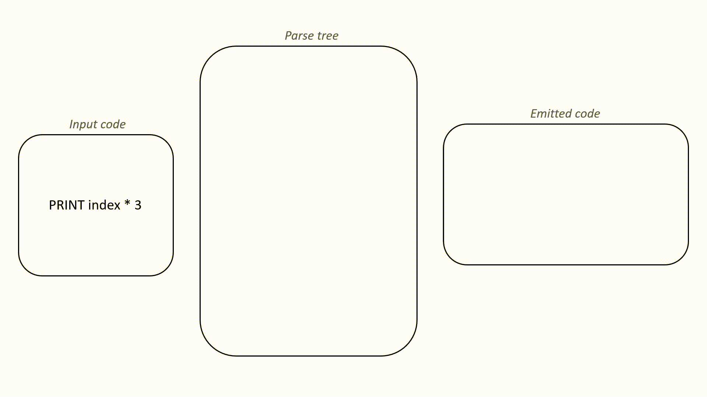{.center style="max-width:90%"}

Try watching the animation a few times. The emitter is utilizing the parse tree to emit the C code in fragments. This will all make more sense when we get to the code.

### Code Setup

First, we will update **main** in **teenytiny.py** to use the emitter that we will soon build:

``` {.prettyprint .lang-python}
from lex import *
from emit import *
from parse import *
import sys

def main():
    print("Teeny Tiny Compiler")

    if len(sys.argv) != 2:
        sys.exit("Error: Compiler needs source file as argument.")
    with open(sys.argv[1], 'r') as inputFile:
        source = inputFile.read()

    # Initialize the lexer, emitter, and parser.
    lexer = Lexer(source)
    emitter = Emitter("out.c")
    parser = Parser(lexer, emitter)

    parser.program() # Start the parser.
    emitter.writeFile() # Write the output to file.
    print("Compiling completed.")

main()
    
```

The compiler still expects a filename as a command line argument to open for input. But now the parser object will control the lexer and the emitter. So next, we have to go on and implement the emitter. Create **emit.py** with the following code:

``` {.prettyprint .lang-python}
# Emitter object keeps track of the generated code and outputs it.
class Emitter:
    def __init__(self, fullPath):
        self.fullPath = fullPath
        self.header = ""
        self.code = ""

    def emit(self, code):
        self.code += code

    def emitLine(self, code):
        self.code += code + '\n'

    def headerLine(self, code):
        self.header += code + '\n'

    def writeFile(self):
        with open(self.fullPath, 'w') as outputFile:
            outputFile.write(self.header + self.code)
```

That is the entirety of the emitter's code! It is simply a helper class for appending strings together. *code* is the string containing the C code that is emitted, *header* contains things that we will prepend to the code later on, and *fullPath* is the path to write the file containing C code. We use **emit** to add a fragment of C code and **emitLine** to add a fragment that ends a line. **headerLine** is for adding a line of C code to the top of the C code file, such as including a library header, the main function, and variable declarations. Lastly, **writeFile** writes the C code to a file.

We then have to make a small change to the parser's **\_\_init\_\_** in **parse.py** to use the emitter:

``` {.prettyprint .lang-python}
    def __init__(self, lexer, emitter):
        self.lexer = lexer
        self.emitter = emitter

        self.symbols = set()    # All variables we have declared so far.
        self.labelsDeclared = set() # Keep track of all labels declared
        self.labelsGotoed = set() # All labels goto'ed, so we know if they exist or not.

        self.curToken = None
        self.peekToken = None
        self.nextToken()
        self.nextToken()    # Call this twice to initialize current and peek.
```

That really is all the emitter entails. Now we just have to call it with the appropriate C code from the parser.

### Emitting Statements

We will now be modifying the existing functions in **parse.py**. We will be calling the emitter functions from inside the parser (and removing the print statements that we used for testing in part 2).

Going through the functions in order, let's look at **program**. To translate an empty Teeny Tiny program, we need some boilerplate C code.  Really, we only need a main function but we will go ahead and include *stdio.h* so that *printf* and *scanf* are available. Update **program** with:

``` {.prettyprint .lang-python}
    # program ::= {statement}
    def program(self):
        self.emitter.headerLine("#include <stdio.h>")
        self.emitter.headerLine("int main(void){")
        
        # Since some newlines are required in our grammar, need to skip the excess.
        while self.checkToken(TokenType.NEWLINE):
            self.nextToken()

        # Parse all the statements in the program.
        while not self.checkToken(TokenType.EOF):
            self.statement()

        # Wrap things up.
        self.emitter.emitLine("return 0;")
        self.emitter.emitLine("}")

        # Check that each label referenced in a GOTO is declared.
        for label in self.labelsGotoed:
            if label not in self.labelsDeclared:
                self.abort("Attempting to GOTO to undeclared label: " + label)
```

The additions here are starting out with the include statement and the main function. Then we loop through all of the *self.statement()*. At the end, we have to close up the main function with *return 0;* and a closing curly bracket.

We will continue to use the emitter just like so. Emit some initial code, call other parser functions based on the grammar, and emit more code before returning up the call stack.

Let's test our emitter thus far. Assuming your **hello.teeny** with the Fibonacci code example still exists from last time, run *python3 teenytiny.py hello.teeny*. If things go as planned, the last line in the terminal should be \"Compiling completed.\" and **out.c** should have been created. Check the contents of the emitted code and you should see:

``` {.prettyprint .lang-c}
#include <stdio.h>
int main(void){
return 0;
}
```

OUR COMPILER JUST COMPILED SOMETHING!

That is right, our Teeny Tiny compiler can now emit a working C program.  (Ignore the lack of code formatting...) If you are on Mac or Linux then you can run *clang out.c* or *gcc out.c* to create an executable, and then *./a.out* to run the program. It won't output anything just yet.  Soon though. Very soon. If you don't have access to a C compiler, you can use [Repl.it](https://repl.it/languages/c) to run C code in the browser.

Next we will update *PRINT* inside the **statement** function of **parse.py**. Recall that there are two cases for the print statement: printing a string and printing the result of an expression. Here is the code:

``` {.prettyprint .lang-python}
        # "PRINT" (expression | string)
        if self.checkToken(TokenType.PRINT):
            self.nextToken()

            if self.checkToken(TokenType.STRING):
                # Simple string, so print it.
                self.emitter.emitLine("printf(\"" + self.curToken.text + "\\n\");")
                self.nextToken()

            else:
                # Expect an expression and print the result as a float.
                self.emitter.emit("printf(\"%" + ".2f\\n\", (float)(")
                self.expression()
                self.emitter.emitLine("));")
```

Look at how we are emitting fragments of C code. Hopefully this is starting to make more sense.

Run your compiler with **hello.teeny** again and check **out.c**:

``` {.prettyprint .lang-c}
#include <stdio.h>
int main(void){
printf("How many fibonacci numbers do you want?\n");
printf("\n");
printf("%.2f\n", (float)());
return 0;
}
```

This is fantastic. Teeny Tiny now emits code for printing strings. Run this with your favorite C compiler and it will work. One thing to note is that the third *printf* isn't doing anything. This is because **expression** isn't emitting anything yet. Eventually this will produce a number.

Continuing through the parser, let's replace the code for *IF* and *WHILE* statements. They look almost identical:

``` {.prettyprint .lang-python}
        # "IF" comparison "THEN" block "ENDIF"
        elif self.checkToken(TokenType.IF):
            self.nextToken()
            self.emitter.emit("if(")
            self.comparison()

            self.match(TokenType.THEN)
            self.nl()
            self.emitter.emitLine("){")

            # Zero or more statements in the body.
            while not self.checkToken(TokenType.ENDIF):
                self.statement()

            self.match(TokenType.ENDIF)
            self.emitter.emitLine("}")

        # "WHILE" comparison "REPEAT" block "ENDWHILE"
        elif self.checkToken(TokenType.WHILE):
            self.nextToken()
            self.emitter.emit("while(")
            self.comparison()

            self.match(TokenType.REPEAT)
            self.nl()
            self.emitter.emitLine("){")

            # Zero or more statements in the loop body.
            while not self.checkToken(TokenType.ENDWHILE):
                self.statement()

            self.match(TokenType.ENDWHILE)
            self.emitter.emitLine("}")
```

If you test this code with the Fibonacci example, you'll find something very broken. The C code contains *while(){*. Uhoh. This is the same problem as before, nothing is being emitted by functions like **expression** and **comparison**. But the rest of the loop looks correct.

The *LABEL* and *GOTO* code is fairly straightforward:

``` {.prettyprint .lang-python}
        # "LABEL" ident
        elif self.checkToken(TokenType.LABEL):
            self.nextToken()

            # Make sure this label doesn't already exist.
            if self.curToken.text in self.labelsDeclared:
                self.abort("Label already exists: " + self.curToken.text)
            self.labelsDeclared.add(self.curToken.text)

            self.emitter.emitLine(self.curToken.text + ":")
            self.match(TokenType.IDENT)

        # "GOTO" ident
        elif self.checkToken(TokenType.GOTO):
            self.nextToken()
            self.labelsGotoed.add(self.curToken.text)
            self.emitter.emitLine("goto " + self.curToken.text + ";")
            self.match(TokenType.IDENT)
```

We will skip testing everything for a moment to get to something more interesting.

The *LET* code is a bit different. It will sometimes call **emitter.headerLine**. Why? Because the first time a variable is referenced in Teeny Tiny it should emit a variable declaration in C, and place it at the top of the main function (this is an old C convention).  As I alluded to earlier, this is one of the major differences in syntax between Teeny Tiny and C, so our compiler has to do a little more work to translate. Teeny Tiny doesn't differentiate between variable declarations and assignments, but C does. Here is the code:

``` {.prettyprint .lang-python}
        # "LET" ident = expression
        elif self.checkToken(TokenType.LET):
            self.nextToken()

            #  Check if ident exists in symbol table. If not, declare it.
            if self.curToken.text not in self.symbols:
                self.symbols.add(self.curToken.text)
                self.emitter.headerLine("float " + self.curToken.text + ";")

            self.emitter.emit(self.curToken.text + " = ")
            self.match(TokenType.IDENT)
            self.match(TokenType.EQ)
            
            self.expression()
            self.emitter.emitLine(";")
```

Ok ok, compile **hello.teeny** and inspect **out.c**...

``` {.prettyprint .lang-c}
#include <stdio.h>
int main(void){
float a;
float b;
float c;
printf("How many fibonacci numbers do you want?\n");
printf("\n");
a = ;
b = ;
while(){
printf("%.2f\n", (float)());
c = ;
a = ;
b = ;
nums = ;
}
return 0;
}
```

The code definitely isn't error free, plus things are a bit hard to read without formatting. You'll see that the variable declarations are all at the top though! That is exciting. So what isn't working? Well *a = ;* certainly isn't valid C code. Looks like all the variable assignments are broken. In fact, anything that calls **expression** is emitting invalid code (still). We are making significant progress though!

Alright, we have one more type of statement to support: *INPUT*. There are a few things to note about this. First, if the variable being referenced doesn't already exist, then we should declare it by using **emitter.headerLine**. Second, we have to include some C specific code because of how *scanf* works. We could just emit *scanf(\"%f\", &foo);*, but that won't handle invalid input, such as when a user enters a letter. So we must also check if scanf returns 0. If it does, we clear the input buffer and we set the input variable to 0.

Note: This will be a limitation of Teeny Tiny. You can't tell if the user input was the value 0 or an invalid input. They are treated the same. There are ways to fix this though. You could modify it such that an invalid input results in an obscure value, like -999, or prints an error message and asks for a valid input in a loop, or sets an error code in a flag. Every programming language handles these types of scenarios differently. The value of 0 will work for now though.

Let's venture forth with the code. It looks a bit ugly, but it is really just some boilerplate for handling invalid input. Here it is:

``` {.prettyprint .lang-python}
        # "INPUT" ident
        elif self.checkToken(TokenType.INPUT):
            self.nextToken()

            # If variable doesn't already exist, declare it.
            if self.curToken.text not in self.symbols:
                self.symbols.add(self.curToken.text)
                self.emitter.headerLine("float " + self.curToken.text + ";")

            # Emit scanf but also validate the input. If invalid, set the variable to 0 and clear the input.
            self.emitter.emitLine("if(0 == scanf(\"%" + "f\", &" + self.curToken.text + ")) {")
            self.emitter.emitLine(self.curToken.text + " = 0;")
            self.emitter.emit("scanf(\"%")
            self.emitter.emitLine("*s\");")
            self.emitter.emitLine("}")
            self.match(TokenType.IDENT)
```

Go ahead and test this. All of our statements now emit C code!

### Emitting Expressions

The last remaining thing to emit code for are expressions. This is actually very little work since Teeny Tiny code requires essentially no changes in order to be valid C code, so just emit it as is. What I mean is that *index \* offset + 1* in Teeny Tiny is also *index \* offset + 1* in C.

We will first take care of **comparison**, which will only emit the specific operator.

``` {.prettyprint .lang-python}
    # comparison ::= expression (("==" | "!=" | ">" | ">=" | "<" | "<=") expression)+
    def comparison(self):
        self.expression()
        # Must be at least one comparison operator and another expression.
        if self.isComparisonOperator():
            self.emitter.emit(self.curToken.text)
            self.nextToken()
            self.expression()
        # Can have 0 or more comparison operator and expressions.
        while self.isComparisonOperator():
            self.emitter.emit(self.curToken.text)
            self.nextToken()
            self.expression()
```

In fact, this is so simple that **expression**, **term**, and **unary** also work the same way: just emit the operator.

``` {.prettyprint .lang-python}
    # expression ::= term {( "-" | "+" ) term}
    def expression(self):
        self.term()
        # Can have 0 or more +/- and expressions.
        while self.checkToken(TokenType.PLUS) or self.checkToken(TokenType.MINUS):
            self.emitter.emit(self.curToken.text)
            self.nextToken()
            self.term()


    # term ::= unary {( "/" | "*" ) unary}
    def term(self):
        self.unary()
        # Can have 0 or more *// and expressions.
        while self.checkToken(TokenType.ASTERISK) or self.checkToken(TokenType.SLASH):
            self.emitter.emit(self.curToken.text)
            self.nextToken()
            self.unary()


    # unary ::= ["+" | "-"] primary
    def unary(self):
        # Optional unary +/-
        if self.checkToken(TokenType.PLUS) or self.checkToken(TokenType.MINUS):
            self.emitter.emit(self.curToken.text)
            self.nextToken()        
        self.primary()
```

We have emitted code from all of our grammar functions except **primary**. Once we reach this point, the only thing to emit is either the number literal or the variable identifier, like so:

``` {.prettyprint .lang-python}
    # primary ::= number | ident
    def primary(self):
        if self.checkToken(TokenType.NUMBER): 
            self.emitter.emit(self.curToken.text)
            self.nextToken()
        elif self.checkToken(TokenType.IDENT):
            # Ensure the variable already exists.
            if self.curToken.text not in self.symbols:
                self.abort("Referencing variable before assignment: " + self.curToken.text)

            self.emitter.emit(self.curToken.text)
            self.nextToken()
        else:
            # Error!
            self.abort("Unexpected token at " + self.curToken.text)
```

While we are here, go ahead and remove the *print* from **nl**.

That is it! Teeny Tiny compiles to C code now! Let's test it with a new example, **average.teeny**:

``` prettyprint
# Compute average of given values.

LET a = 0
WHILE a < 1 REPEAT
    PRINT "Enter number of scores: "
    INPUT a
ENDWHILE

LET b = 0
LET s = 0
PRINT "Enter one value at a time: "
WHILE b < a REPEAT
    INPUT c
    LET s = s + c
    LET b = b + 1
ENDWHILE

PRINT "Average: "
PRINT s / a
```

When you run Teeny Tiny on this, all you should see is:

``` prettyprint
Teeny Tiny Compiler
Compiling completed.
```

If you take a look at **out.c**, you'll see this glorious code:

``` {.prettyprint .lang-c}
#include <stdio.h>
int main(void){
float a;
float b;
float s;
float c;
a = 0;
while(a<1){
printf("Enter number of scores: \n");
if(0 == scanf("%f", &a)) {
a = 0;
scanf("%*s");
}
}
b = 0;
s = 0;
printf("Enter one value at a time: \n");
while(b<a){
if(0 == scanf("%f", &c)) {
c = 0;
scanf("%*s");
}
s = s+c;
b = b+1;
}
printf("Average: \n");
printf("%.2f\n", (float)(s/a));
return 0;
}        
```

Run it through a C compiler. Wow. Look at that. We made a real compiler.  Move over Borland!

### Compiling Teeny Tiny

You may notice that it is bit tedious to use Teeny Tiny. First, we have to run the Python script. Second, we run the C compiler. Third, we execute the program. There really shouldn't be so many steps. You could build this all into Teeny Tiny or you could write a script to automate it.

My friend, [Stephen Marz](https://blog.stephenmarz.com/), made a Bash script that I find helpful:

``` {.prettyprint .lang-bash}
PYTHON="python3"
COMPILER="teenytiny.py"
CC="gcc"

function comp {
    BN=$(basename -s .teeny $1)
    TTOUTPUT=$(${PYTHON} ${COMPILER} $1 2>&1)
    if [ $? -ne 0 ]; then
        echo "${TTOUTPUT}"
    else
        mv out.c ${BN}.c
        CCOUTPUT=$(${CC} -o ${BN} ${BN}.c)
        if [ $? -ne 0 ]; then
            echo "${CCOUTPUT}"
        else
            echo "${TTOUTPUT}"
        fi
    fi
}

if [ $# -eq 0 ]; then
    for i in $(ls examples/*.teeny); do
        comp $i
    done
else
    comp $1
fi
```

You can run it by doing *bash build.sh hello.teeny* in the terminal, and then you run the executable like *./hello* .

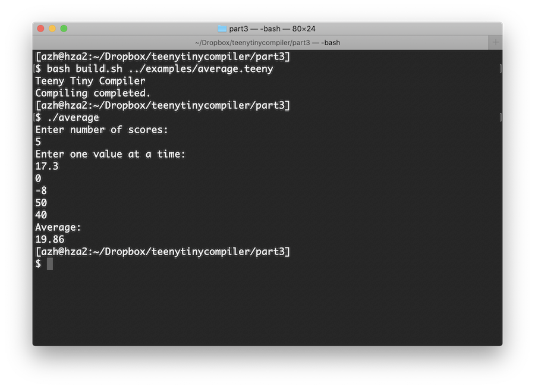{.center style="max-width:80%;"}

### The project continues...

Your Teeny Tiny compiler is working! Given code written in our own language, the compiler will produce working C code that can be compiled and executed. This is quite the feat. If you add a few more features, you could make a Teeny Tiny compiler that is written in Teeny Tiny code!  Compilers all the way down.

The complete source code for Teeny Tiny can be found in the Github [repo](https://github.com/AZHenley/teenytinycompiler).

Although the tutorial ends here, your compiler adventure doesn't have to. You could switch up the syntax or there are numerous features that you can add to incrementally improve the language and compiler. For example:

-   Parentheses for expressions
-   Logical operators (and, or, not)
-   ELSE IF and ELSE
-   FOR loop
-   Number literals written in binary, hex, and octal
-   Better compiler errors (e.g., what line the error occurred)
-   Allow multiple code files
-   Functions with parameters and return values
-   Lexical scope (see [scope](https://en.wikipedia.org/wiki/Scope_(computer_science)))
-   Standard library (e.g., file operations)
-   [Abstract syntax tree](https://en.wikipedia.org/wiki/Abstract_syntax_tree) representation
-   More primitive types (e.g., integer, strings, boolean)
-   Arrays
-   Record types (i.e., structs or tuples)
-   Type checking (see [type systems](https://en.wikipedia.org/wiki/Type_system))
-   Compiler optimizations (e.g., [constant folding](https://en.wikipedia.org/wiki/Constant_folding))
-   Test cases for the compiler (see [unit testing](https://en.wikipedia.org/wiki/Unit_testing) and [test-driven development](https://en.wikipedia.org/wiki/Test-driven_development))

Most notable is the abstract syntax tree (AST) representation. This is one of the major things that this tutorial left out that basically all compilers use. It is an intermediate representation of the code that enables you to perform all sorts of analyses and optimizations on the code before the emitting stage. Fortunately, the way we built our compiler means that it is extremely easy to produce an AST!

------------------------------------------------------------------------

Reach out to me and let me know what I should write about next because I doubt I'm done with the Teeny Tiny project. Until then, I also highly recommend reading these longer tutorials:

-   Writing an Interpreter in Go ([Amazon](https://amzn.to/2Saf28j))
-   Crafting Interpreters ([Amazon](https://amzn.to/3l8FePX), [web](https://craftinginterpreters.com/contents.html))

